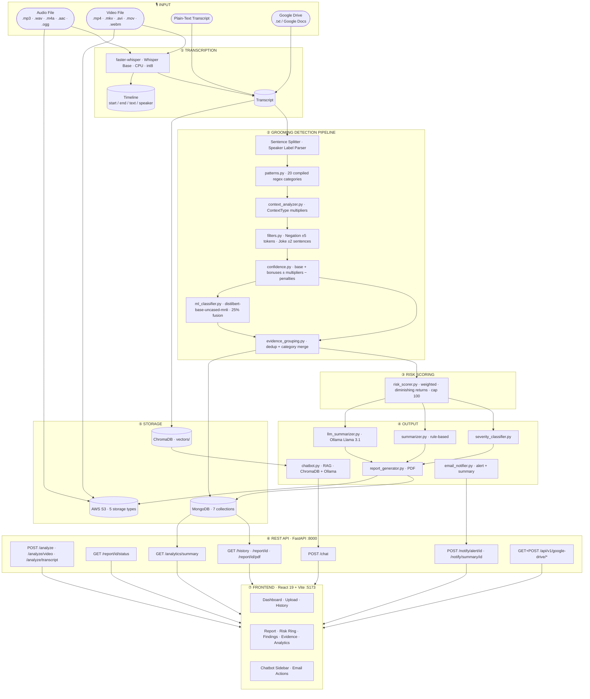

# AuraSafety — AI-Powered Audio Grooming Detection

> Detect grooming, manipulation, and harmful language in audio conversations using a multi-stage AI pipeline — regex patterns, context classification, ML zero-shot NLI, LLM summaries, email alerts, and a RAG chatbot.


---

## What it does

AuraSafety accepts audio files, video files, plain-text transcripts, or Google Drive documents, and runs them through a layered detection pipeline that identifies **20 categories** of harmful behaviour — from grooming tactics and manipulation to explicit content, threats, gift-bribery, isolation, emotional exploitation, and age deception. Every finding is scored, grouped, and surfaced in a React dashboard with confidence breakdowns, ML analysis, a timeline view, and a downloadable PDF report. High-severity results trigger automatic email alerts. All data is persisted to MongoDB (7 collections) and AWS S3.

---

## Architecture



---

## Repository Structure

```
AuraSafety/
├── backend/                        # FastAPI + Python detection pipeline
│   ├── app.py                      # Main FastAPI app — all routes + background tasks
│   ├── config.py                   # Paths, SMTP, S3, MongoDB, Google Drive config
│   ├── requirements.txt
│   ├── start.bat                   # Windows one-click server start
│   ├── test_pipeline.py            # Interactive CLI pipeline tester
│   ├── test_email.py               # 4-step SMTP integration test
│   ├── debug_env.py                # Low-level SMTP credential debugger
│   ├── .env.example                # Environment variable template
│   │
│   ├── api/
│   │   ├── audio_analysis_routes.py    # Versioned router /api/v1/* (synchronous, Pydantic)
│   │   └── google_drive_routes.py      # Google Drive router /api/v1/google-drive/*
│   ├── services/
│   │   ├── audio_safety_service.py     # Async pipeline orchestration
│   │   └── google_drive_service.py     # Google OAuth2 + Drive/Docs file access
│   ├── schemas/
│   │   └── audio_analysis_schemas.py   # Pydantic request/response models
│   │
│   ├── modules/
│   │   ├── patterns.py             # 20-category compiled regex library
│   │   ├── context_analyzer.py     # ContextType enum + multipliers
│   │   ├── confidence.py           # Confidence scoring engine
│   │   ├── filters.py              # NegationFilter + JokeFilter
│   │   ├── ml_classifier.py        # Zero-shot NLI (DistilBERT-MNLI)
│   │   ├── grooming_detector.py    # Main pipeline orchestrator
│   │   ├── evidence_grouping.py    # Deduplication + category merging
│   │   ├── risk_scorer.py          # Weighted risk scoring (0–100)
│   │   ├── severity_classifier.py  # Score → Safe/Low/Moderate/High/Critical
│   │   ├── summarizer.py           # Rule-based summary
│   │   ├── llm_summarizer.py       # Ollama Llama 3.1 summary
│   │   ├── report_generator.py     # PDF report generation
│   │   ├── transcriber.py          # Faster-Whisper transcription + PyAV video extraction
│   │   ├── evidence_extractor.py   # Evidence list extraction
│   │   ├── stats.py                # Statistics + timeline + ML agreement
│   │   ├── chatbot.py              # RAG chatbot (ChromaDB + Ollama)
│   │   ├── email_notifier.py       # SMTP alert + summary HTML emails
│   │   ├── s3_storage.py           # AWS S3 upload / presign / delete
│   │   ├── drive_watcher.py        # Google Drive background auto-import watcher
│   │   ├── cache.py                # TTL in-memory cache helpers
│   │   └── file_cleanup.py         # Upload file cleanup daemon
│   │
│   ├── database/
│   │   └── mongo.py                # MongoDB client — 7-collection schema + read helpers
│   │
│   ├── examples/
│   │   ├── test_script_bad.txt     # CRITICAL — all categories triggered
│   │   ├── test_script_medium.txt  # MODERATE — ambiguous online chat
│   │   ├── test_script_good.txt    # LOW — safe classroom exchange
│   │   └── run_test_scripts.py     # Pipeline test runner
│   │
│   └── (auto-created on first run, git-ignored)
│       ├── uploads/                # Uploaded audio/video files (temp)
│       ├── reports/                # Generated PDF reports
│       ├── vectors/                # ChromaDB persistent vector store
│       └── logs/app.log            # Application log (UTF-8, stdout + file)
│
└── frontend/                       # React 19 + Vite dashboard
    ├── src/
    │   ├── pages/
    │   │   ├── Dashboard.jsx       # History table — search, sort, stat cards
    │   │   ├── Report.jsx          # 6-tab report — Overview, Findings, Evidence,
    │   │   │                       #   Timeline, Analytics, Raw Data + Chatbot sidebar
    │   │   └── Upload.jsx          # Drag-and-drop upload (audio + video) with progress bar
    │   ├── components/
    │   │   ├── Chatbot.jsx         # AI chatbot sidebar (RAG)
    │   │   └── ErrorBoundary.jsx   # React error boundary
    │   └── api.js                  # Axios client — all API calls
    └── vite.config.js              # Dev proxy /api/v1/* → :8000
```

---

## Detection Categories

The pipeline detects **20 categories** across the full grooming lifecycle — from initial contact and trust-building through to escalation, coercion, and explicit harm.

### Core Grooming Tactics

| Category | Severity | Weight | Description |
|---|---|---|---|
| `explicit_content` | **Critical** | 25 | Sexual solicitation, nude requests, sexting, CSAM references |
| `threats_coercion` | **Critical** | 22 | Blackmail, photo threats, reputation threats, "do it or else" |
| `meeting` | **Critical** | 20 | Arranging in-person contact, "sneak out", "come to my place" |
| `address` | **Critical** | 20 | Requesting physical location, home address, zip code |
| `secrecy` | **Critical** | 15 | "Don't tell anyone", "delete these messages", "our secret" |
| `manipulation` | **Critical** | 10 | Coercion, conditional threats, peer pressure, proof demands |
| `emotional_exploitation` | **Critical** | 18 | Guilt-tripping, "you're all I have", self-harm threats as control |
| `isolation` | **Critical** | 16 | Discrediting friends/family, "you only need me", encouraging withdrawal |

### Information Gathering

| Category | Severity | Weight | Description |
|---|---|---|---|
| `personal_information` | **High** | 18 | Phone numbers, email, social handles, real name, age, passwords |
| `parent_monitoring` | **High** | 15 | Questions about parental supervision of messages/phone |
| `school` | **High** | 10 | School name, grade, dismissal time, teacher names |
| `routine` | **High** | 10 | Daily schedule, walk-home route, when alone at home |

### Relationship & Trust Building

| Category | Severity | Weight | Description |
|---|---|---|---|
| `relationship_building` | **High** | 5 | Building personal dependency, "you're special to me" |
| `video_call` | **High** | 10 | Video call requests, camera requests, selfie demands |
| `age_deception` | **High** | 14 | "I'm the same age", "age is just a number", "you're mature for your age" |
| `desensitization` | **High** | 14 | "It's normal", "everyone does it", minimising inappropriate behaviour |
| `gift_bribery` | **High** | 12 | Gift offers, money, gaming currency, "I'll buy you anything" |
| `gaming_luring` | **Medium** | 10 | Roblox/Fortnite contact, "join my private server", moving to DMs |
| `trust_building` | **Medium** | 5 | "Trust me", "I'm here for you", "you can tell me anything" |
| `bad_language` | **Medium** | 8 | Profanity, slurs, hate speech, aggressive/threatening language |

---

## Risk Scoring

Risk scores are calculated on a **0–100 scale** using a weighted, diminishing-returns formula:

```
effective_score = weight × confidence          (1st occurrence)
effective_score = weight × confidence × DR     (repeated occurrences)
total_score     = Σ effective_scores, capped at 100
```

**Diminishing returns** — repeated occurrences of the same category are progressively down-weighted (100% → 50% → 25% → 12.5% → …) so a single repeated phrase cannot dominate the score.

| Risk Level | Score Range | Meaning |
|---|---|---|
| Safe | 0–20 | No significant indicators |
| Low | 21–40 | Minor concerns, may warrant monitoring |
| Moderate | 41–60 | Multiple indicators, increased monitoring recommended |
| High | 61–80 | Significant patterns, immediate review recommended |
| Critical | 81–100 | Severe behaviour, urgent intervention required |

---

## Tech Stack

| Layer | Technology |
|---|---|
| API | FastAPI + Uvicorn |
| Transcription | Faster-Whisper (base model, CPU, int8) |
| Video Audio Extraction | PyAV (streamed, 1 MB chunks) |
| Pattern Detection | Python `re` — compiled regex, 20 categories |
| ML Classifier | `typeform/distilbert-base-uncased-mnli` — Zero-Shot NLI |
| LLM Summary | Ollama — Llama 3.1 |
| Vector Store | ChromaDB (persistent) |
| Embeddings | SentenceTransformers `all-MiniLM-L6-v2` |
| Primary Database | MongoDB Atlas — 7 collections |
| File Storage | AWS S3 — 5 storage types, AES-256 encrypted |
| Email | SMTP (Gmail / any provider) — HTML alert + summary templates |
| PDF | ReportLab via `report_generator.py` |
| Google Drive | Google Drive API + Google Docs API (OAuth2) |
| Frontend | React 19 + Vite 8 |
| Charts | Recharts |
| Icons | Lucide React |

---

## Quick Start

### Prerequisites

- Python 3.10+
- Node.js 18+
- [Ollama](https://ollama.com) *(optional — for LLM summaries and chatbot)*

### 1. Clone

```bash
git clone https://github.com/your-username/aurasafety.git
cd aurasafety
```

### 2. Backend

```bash
cd backend

python -m venv venv

# Windows
venv\Scripts\activate
# macOS / Linux
source venv/bin/activate

pip install -r requirements.txt

# Copy and fill in environment variables (see Environment Variables section)
cp .env.example .env

uvicorn app:app --host 0.0.0.0 --port 8000 --reload
```

On Windows you can also use the included batch script:

```bash
start.bat
```

Backend runs at **http://localhost:8000**
- Swagger UI: http://localhost:8000/docs
- ReDoc: http://localhost:8000/redoc

### 3. Frontend

```bash
cd frontend
npm install
npm run dev
```

Frontend runs at **http://localhost:5173**

The Vite dev server proxies `/api/v1/*` → `http://localhost:8000` automatically.

### 4. Ollama (optional)

```bash
ollama pull llama3.1
```

If Ollama is not running, the system falls back to the rule-based summary. All other features work without it.

---

## Environment Variables

Copy `backend/.env.example` to `backend/.env`. All integrations are optional — the core analysis pipeline runs without them.

```env
# ── SMTP — email alerts and summaries ────────────────────────────────────────
SMTP_HOST=smtp.gmail.com
SMTP_PORT=587
SMTP_USER=your-email@gmail.com
SMTP_PASSWORD=your-16-char-app-password   # Gmail: use an App Password, not your account password
SMTP_FROM_NAME=AuraSafety
ALERT_RECIPIENTS=analyst@yourorg.com,supervisor@yourorg.com
ALERT_SEVERITY=High          # High or Critical — threshold for auto-alerts
APP_URL=http://localhost:5173 # used in "View Report" email links

# ── MongoDB — primary data store ──────────────────────────────────────────────
MONGO_URI=mongodb+srv://<user>:<password>@<cluster>.mongodb.net/<dbname>?retryWrites=true&w=majority
MONGO_DB_NAME=audio_safety_db

# ── AWS S3 — file storage ─────────────────────────────────────────────────────
AWS_ACCESS_KEY_ID=your-access-key-id
AWS_SECRET_ACCESS_KEY=your-secret-access-key
AWS_REGION=us-east-1
S3_BUCKET_NAME=your-bucket-name   # note: S3_BUCKET_NAME (not S3_BUCKET)

# ── Feature flags ─────────────────────────────────────────────────────────────
ENABLE_ML_CLASSIFIER=false        # set true after ~400 MB model is cached
ENABLE_LLM_SUMMARY=true           # set false to skip Ollama entirely (faster)
MAX_UPLOAD_MB=200                 # max audio upload size in MB
MAX_VIDEO_UPLOAD_MB=500           # max video upload size in MB
ALLOWED_ORIGINS=http://localhost:5173,http://127.0.0.1:5173
API_KEY=                          # leave blank to disable auth in dev
UPLOAD_TTL_HOURS=24               # 0 = disable upload cleanup

# ── Speaker diarization (pyannote.audio) ──────────────────────────────────────
HF_TOKEN=your-huggingface-token   # required for pyannote.audio
ENABLE_DIARIZATION=false          # adds ~90s per 3-min file on CPU

# ── Google Drive integration ──────────────────────────────────────────────────
GOOGLE_CLIENT_ID=your-google-client-id.apps.googleusercontent.com
GOOGLE_CLIENT_SECRET=your-google-client-secret
GOOGLE_REDIRECT_URI=http://localhost:8000/api/v1/google-drive/callback
DRIVE_AUTO_WATCH=false            # true = start polling Drive on server startup
DRIVE_POLL_INTERVAL_SECONDS=120   # how often to check Drive for new files (seconds)
DRIVE_WATCH_FOLDER_ID=            # optional: restrict to a specific Drive folder ID
```

> **Gmail tip:** Generate a 16-character App Password at https://myaccount.google.com/apppasswords — do not use your account password. 2FA must be enabled on the Google account first.

---

## Storage

### MongoDB (7 collections) — Primary Store

MongoDB is the sole data store. SQLite has been removed. All analysis results, transcripts, findings, and audit logs are written here. Created automatically on first connection.

| Collection | Contents |
|---|---|
| `meeting_metadata` | Filename, date, duration, participants, S3 URL, status, pdf_path, s3_pdf_url |
| `transcripts` | Full transcript, speaker segments, timestamps, word count |
| `analysis_results` | Risk score, severity, LLM summary, rule summary, stats, evidence |
| `safety_findings` | Per-finding category, evidence, confidence, context type, ML fields |
| `action_items` | High/critical findings requiring action, topics, keywords |
| `processing_status` | Pipeline stage, started_at, completed_at, errors |
| `audit_logs` | All events — uploads, completions, failures, emails sent |

### AWS S3 (5 storage types)

All files are AES-256 server-side encrypted:

| Type | S3 Prefix | Description |
|---|---|---|
| Audio recordings | `recordings/YYYY/MM/` | Original uploaded audio |
| PDF reports | `reports/YYYY/MM/` | Generated analysis PDFs |
| Exports | `exports/YYYY/MM/` | CSV / JSON / XLSX exports |
| Backups | `backups/YYYY/MM/` | Long-term archives |

---

## Email Notifications

Two email types are supported, both rendered as dark-themed HTML with a risk score circle, severity badge, and findings summary.

**Automatic alert** — sent at the end of every analysis where severity meets or exceeds `ALERT_SEVERITY` (default: `High`). Includes top 5 findings and a PDF attachment.

**On-demand summary** — triggered via `POST /notify/summary/{id}`. Includes LLM summary, rule-based summary, and category breakdown table.

**Manual re-send** — `POST /notify/alert/{id}` re-sends the alert email for any report regardless of severity. Accepts an optional `recipients` override.

---

## API Reference

The app exposes two route sets. The root routes (`/analyze`, `/report/…`, etc.) run analysis as a **background task** and include MongoDB, S3, and email. The versioned routes (`/api/v1/…`) are used by the frontend and run analysis **synchronously** with Pydantic-validated responses and pagination on `/history`.

### Core

| Method | Path | Description |
|---|---|---|
| `GET` | `/health` | S3 + MongoDB + service health — returns `{status, service, s3, mongodb}` |
| `POST` | `/analyze` | Upload audio — returns immediately, runs pipeline in background |
| `POST` | `/analyze/video` | Upload video — audio extracted server-side, then analyzed in background |
| `POST` | `/analyze/transcript` | Submit plain-text transcript — skips transcription, runs pipeline in background |
| `GET` | `/report/{id}/status` | Poll status: `PROCESSING` / `COMPLETED` / `FAILED` + `error_message` |
| `GET` | `/history` | All reports — `id`, `filename`, `severity`, `risk_score` |
| `GET` | `/report/{id}` | Full report — transcript, findings, evidence, stats, summaries |
| `GET` | `/report/{id}/evidence` | Evidence list with `severity`, `risk_score`, `context_type`, `speaker` |
| `GET` | `/report/{id}/stats` | Full stats object — see Stats Object below |
| `GET` | `/report/{id}/pdf` | Download PDF report |
| `DELETE` | `/report/{id}` | Delete report from MongoDB, S3, and local PDF |
| `POST` | `/chat` | RAG chatbot — returns `{answer, sources, confidence}` |

### Notifications

| Method | Path | Description |
|---|---|---|
| `POST` | `/notify/alert/{id}` | Send (or re-send) a red-alert email |
| `POST` | `/notify/summary/{id}` | Send a full analysis summary email |

Both accept `{"recipients": ["email@example.com"]}` to override `ALERT_RECIPIENTS`. Both return `{"success": bool, "message": str, "recipients": [...]}` and log to MongoDB `audit_logs`.

### Analytics

| Method | Path | Description |
|---|---|---|
| `GET` | `/analytics/summary` | Cross-report aggregation — severity distribution, risk histogram, top categories, ML agreement, confidence histogram, status distribution |

### Google Drive

| Method | Path | Description |
|---|---|---|
| `GET` | `/api/v1/google-drive/auth-url` | Returns the OAuth2 consent URL |
| `GET` | `/api/v1/google-drive/callback` | Handles OAuth2 redirect, stores tokens |
| `GET` | `/api/v1/google-drive/status` | Returns authentication status |
| `DELETE` | `/api/v1/google-drive/logout` | Revokes and deletes stored credentials |
| `GET` | `/api/v1/google-drive/files` | Lists importable files (`.txt` + Google Docs) |
| `POST` | `/api/v1/google-drive/import` | Imports a file as a transcript and runs the pipeline |
| `GET` | `/api/v1/google-drive/watcher/status` | Returns watcher running state + stats |
| `POST` | `/api/v1/google-drive/watcher/start` | Starts the background auto-import watcher |
| `POST` | `/api/v1/google-drive/watcher/stop` | Stops the watcher |

### Stats Object

`GET /report/{id}/stats` returns:

```json
{
  "word_count": 312,
  "character_count": 1840,
  "finding_count": 8,
  "unique_categories": 5,
  "categories": { "secrecy": 2, "meeting": 1 },
  "severity_distribution": { "critical": 2, "high": 3 },
  "context_type_distribution": { "GROOMING": 4, "NEUTRAL": 2 },
  "speaker_distribution": { "Speaker A": 5, "Speaker B": 3 },
  "confidence_stats": { "average": 0.82, "maximum": 0.97, "minimum": 0.61 },
  "confidence_histogram": { "0-25": 0, "25-50": 1, "50-75": 3, "75-100": 4 },
  "ml_stats": { "total_with_ml": 8, "agreed": 6, "disagreed": 2, "agreement_rate": 0.75 },
  "findings_timeline": [{ "timestamp": 4.0, "confidence": 0.91, "category": "secrecy", "severity": "critical" }],
  "high_confidence_count": 5
}
```

### Examples

```bash
# Upload and analyze audio
curl -X POST http://localhost:8000/analyze -F "file=@conversation.mp3"
# → {"id": 12, "status": "PROCESSING", "message": "Analysis started in background"}

# Upload and analyze video
curl -X POST http://localhost:8000/analyze/video -F "file=@recording.mp4"
# → {"id": 13, "status": "PROCESSING", "message": "Video audio extracted, analysis started in background"}

# Submit a plain-text transcript
curl -X POST http://localhost:8000/analyze/transcript \
  -H "Content-Type: application/json" \
  -d '{"transcript": "Speaker A: keep this between us...", "filename": "chat.txt"}'

# Poll until complete
curl http://localhost:8000/report/12/status
# → {"id": 12, "status": "COMPLETED", "error_message": null}

# Get full report
curl http://localhost:8000/report/12

# Get stats only
curl http://localhost:8000/report/12/stats

# Ask the chatbot
curl -X POST http://localhost:8000/chat \
  -H "Content-Type: application/json" \
  -d '{"report_id": 12, "question": "What secrecy phrases were used?"}'

# Send alert email
curl -X POST http://localhost:8000/notify/alert/12 \
  -H "Content-Type: application/json" \
  -d '{"recipients": ["analyst@example.com"]}'

# Delete a report
curl -X DELETE http://localhost:8000/api/v1/report/12

# Cross-report analytics
curl http://localhost:8000/analytics/summary

# Google Drive — get auth URL
curl http://localhost:8000/api/v1/google-drive/auth-url

# Google Drive — import a file
curl -X POST http://localhost:8000/api/v1/google-drive/import \
  -H "Content-Type: application/json" \
  -d '{"file_id": "1A2B3C...", "file_name": "chat_log.txt", "mime_type": "text/plain"}'
```

## Context Classification

Every sentence is classified into one or more `ContextType` values before confidence scoring. The type drives a multiplier — no speaker identity is ever consulted.

| ContextType | Multiplier | Meaning |
|---|---|---|
| `ADMINISTRATIVE` | −0.40 | Event logistics, forms, schedules — suppresses false positives |
| `INFORMATION_GATHERING` | +0.15 | Collecting personal details |
| `TRUST_BUILDING` | +0.20 | "I care about you", "trust me" |
| `RELATIONSHIP_BUILDING` | +0.15 | "special connection", "best friends" |
| `MANIPULATION` | +0.30 | "they won't understand", coercion |
| `SECRECY` | +0.40 | "don't tell anyone", "our secret" |
| `ESCALATION` | +0.35 | Private call, move to another platform |
| `MEETING` | +0.35 | Meet up, in person, hang out |
| `PERSONAL_INFORMATION` | +0.30 | Address, phone, email, route |
| `VIDEO_CALL` | +0.25 | Video chat, FaceTime, camera requests |
| `EXPLICIT_CONTENT` | +0.50 | Sexual language — highest multiplier |
| `BAD_LANGUAGE` | +0.20 | Profanity, slurs, threats |
| `NEUTRAL` | 0.00 | No strong signal |

---

## Confidence Scoring

```
score = pattern_strength
      + exact_phrase_bonus      (+0.15 if matched text is a known exact phrase)
      + keyword_bonus           (+0.10 if ≥2 supporting keywords present)
      + context_multiplier      (from ContextType above, −0.40 to +0.50)
      − negation_penalty        (up to −0.40, token-scoped within ±5 tokens)
      − joke_penalty            (up to −0.50, ±2 sentence window)

regex_confidence = clamp(score, 0.0, 1.0)

# ML fusion (25% weight, when enabled)
fused_confidence = 0.75 × regex_confidence + 0.25 × ml_category_score
```

---

## ML Classifier

- Model: `typeform/distilbert-base-uncased-mnli` (Zero-Shot NLI via HuggingFace)
- 13 labels mapped to detection categories
- Temperature calibration T=1.3 for better-calibrated probabilities
- Multi-label detection threshold: ≥0.15
- Agreement/disagreement signal surfaced in each finding under `finding["ml"]`
- LRU cache: 512 entries — repeated sentences are free after first inference
- Fused at 25% weight into the final confidence score
- **Disabled by default** (`enable_ml_classifier=False`) — enable once model is cached (~400 MB download on first run)

---

## Configuration Knobs

Key runtime parameters you can tune without touching the pipeline code:

```python
# grooming_detector.py — constructor defaults
GroomingDetector(
    min_confidence_threshold = 0.15,   # drop findings below this (API default: 0.30)
    enable_context_analysis  = True,   # apply ContextType multipliers
    enable_filters           = True,   # apply negation + joke penalties
    enable_grouping          = True,   # deduplicate via EvidenceGroupingEngine
    enable_ml_classifier     = False,  # set True once model is cached (~400 MB)
)

# risk_scorer.py — weight overrides
WeightedRiskScorer(
    custom_weights = {"explicit_content": 30, "threats_coercion": 25},
    enable_diminishing_returns = True,
)

# audio_safety_service.py — service-level flags
AudioSafetyService(
    min_confidence_threshold = 0.30,
    enable_llm_summary       = True,   # set False to skip Ollama entirely
    enable_vector_storage    = True,   # set False to skip ChromaDB indexing
)
```

---

## How the Pipeline Works

```
Audio File
  └─► Faster-Whisper transcription
        └─► Sentence splitting + speaker label parsing
              └─► Regex pattern matching (20 categories)
                    └─► Context classification (ContextType multiplier)
                          └─► Negation filter (token-scoped ±5 tokens)
                                └─► Joke filter (±2 sentence window)
                                      └─► Confidence scoring
                                            └─► ML zero-shot NLI (25% fusion weight)
                                                  └─► Evidence grouping + deduplication
                                                        └─► Weighted risk scoring (0–100)
                                                              └─► Severity classification
                                                                    └─► Rule summary + LLM summary
                                                                          └─► PDF + SQLite + MongoDB + S3
                                                                                └─► Auto email alert (if High/Critical)
```

### Key design decisions

**No role-based assumptions.** Speaker labels are stored for audit only. The same sentence scores identically regardless of who said it.

**Token-scoped negation.** "I did not ask for your address" is negated. "I never lie but I want your address" is not — the negation word is too far from the matched phrase. Secrecy phrases like "nobody needs to know" are exempt because the negation is part of the threat.

**Diminishing returns.** The first occurrence of any category gets full weight. Repeated occurrences are progressively down-weighted (50%, 25%, 12.5%, …) so a single repeated phrase cannot dominate the score.

**Administrative suppression.** Sentences classified as `ADMINISTRATIVE` receive a −0.40 confidence multiplier, suppressing false positives from legitimate institutional language.

**Graceful degradation.** MongoDB, S3, SMTP, and Ollama are all optional. A failure in any of them is logged as a warning and the pipeline continues. The core analysis always runs.

**Background processing.** `/analyze` returns immediately with a record ID. The client polls `/report/{id}/status` until `COMPLETED`.

---

## Frontend

The React 19 dashboard has three routes:

| Route | Page | Description |
|---|---|---|
| `/` | Dashboard | Analysis history table with live search, sortable columns (filename, severity, risk score), and 4 stat cards — total analyses, average risk score, critical findings, high findings |
| `/upload` | Analyze Audio | Drag-and-drop or click-to-upload (audio or video files) with real-time progress bar; polls status until complete then redirects to the report |
| `/report/:id` | Report | Full analysis view — see tabs below |

### Report Page Tabs

| Tab | Contents |
|---|---|
| **Overview** | Risk ring (animated 0–100 gauge), severity badge, LLM summary, rule-based summary, category breakdown |
| **Findings** | Grouped findings with confidence bars, matched text, context type, filter flags (negated / joke), ML label and agreement signal, scoring breakdown |
| **Evidence Log** | Flat evidence list — timestamp, category badge, severity, speaker label, confidence, context type, base confidence, context multiplier |
| **Timeline** | Scatter chart of findings over time — x-axis: timestamp, y-axis: confidence, colour-coded by category |
| **Analytics** | Per-report charts — category distribution (bar), severity distribution (pie), confidence histogram (bar), context type distribution (bar), speaker distribution (bar), ML agreement rate |
| **Raw Data** | Full JSON dump of the report object — useful for debugging |

The chatbot sidebar is available on the Report page. It sends questions to `POST /chat` and displays the answer with source excerpts.

---

## Google Drive Integration

AuraSafety can connect to Google Drive to import `.txt` files and Google Docs directly as transcripts — no audio upload needed.

### Setup

1. Go to [Google Cloud Console](https://console.cloud.google.com/)
2. Create a project → Enable **Google Drive API** and **Google Docs API**
3. Create OAuth 2.0 credentials (type: Web application)
4. Add `http://localhost:8000/api/v1/google-drive/callback` as an Authorized Redirect URI
5. Copy the Client ID and Client Secret to `backend/.env`

### Auth Flow

```
GET /api/v1/google-drive/auth-url   → returns consent URL
# Open URL in browser, grant access
GET /api/v1/google-drive/callback   → exchanges code for tokens (stored on disk)
GET /api/v1/google-drive/status     → confirms authentication
```

### Auto-Watcher

Set `DRIVE_AUTO_WATCH=true` in `.env` to automatically start polling Drive on server startup. The watcher checks for new files every `DRIVE_POLL_INTERVAL_SECONDS` (default: 120 s) and imports them automatically. Optionally restrict to a specific folder with `DRIVE_WATCH_FOLDER_ID`.

---

## Utility Scripts

### `test_email.py` — Email Integration Test

Verifies the full SMTP setup in 4 steps without needing a real audio file:

```bash
cd backend
python test_email.py
```

1. **Config check** — validates `SMTP_USER`, `SMTP_PASSWORD`, `ALERT_RECIPIENTS` are set
2. **SMTP connection** — connects to the server, runs STARTTLS, authenticates
3. **Alert email** — sends a real red-alert email with mock Critical findings
4. **Summary email** — sends a real summary email with mock data

Exits with a clear error message and fix instructions if any step fails. Use this before deploying to confirm email works end-to-end.

### `debug_env.py` — SMTP Credential Debugger

Low-level SMTP auth debugger for diagnosing Gmail App Password issues:

```bash
cd backend
python debug_env.py
```

Prints the raw credential values (length, leading/trailing chars, presence of spaces or quotes) and attempts a direct `smtplib` login. Useful when `test_email.py` fails at the authentication step.

### `test_pipeline.py` — Interactive CLI Tester

```bash
cd backend
python test_pipeline.py
```

Runs any sentence or multi-line transcript through the full detection pipeline interactively. Each input prints a 4-section output:

1. **Context classification** — matched ContextType(s) and multiplier
2. **Filter results** — negation score, joke score, combined penalty
3. **Per-category findings** — category, confidence, matched text, severity
4. **Risk breakdown** — weighted score per category, total risk score, risk level

```
pipeline> keep this between us, nobody needs to know
pipeline> age is just a number
pipeline> I'll buy you whatever you want
pipeline> clear          ← clears the screen
```

The tester uses a lower confidence threshold (0.15) than the API default (0.30) to surface borderline matches during development.

---

## Running the Test Scripts

```bash
cd backend
python examples/run_test_scripts.py
```

| Script | Risk Score | Severity | What it tests |
|---|---|---|---|
| `test_script_bad.txt` | 100 | CRITICAL | Grooming conversation — all categories triggered |
| `test_script_medium.txt` | ~53 | MODERATE | Ambiguous online gaming chat — trust-building, routine probing, video call |
| `test_script_good.txt` | 0 | LOW | Normal classroom exchange — zero findings |

Set `ENABLE_ML = True` in `run_test_scripts.py` to include the ML classifier layer (~400 MB model download on first run).

---

## Contributing

1. Fork the repository
2. Create a feature branch: `git checkout -b feature/your-feature`
3. Commit your changes: `git commit -m "add: your feature"`
4. Push to the branch: `git push origin feature/your-feature`
5. Open a pull request

---

## License

MIT License — see [LICENSE](LICENSE) for details.
