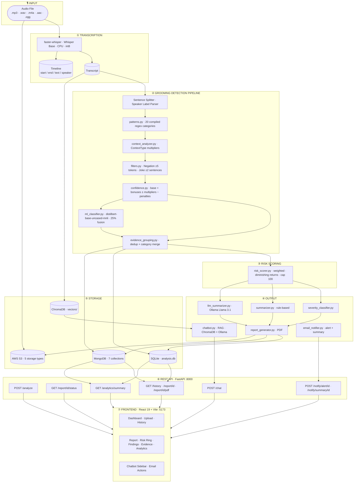

# AuraSafety — AI-Powered Audio Grooming Detection

> Detect grooming, manipulation, and harmful language in audio conversations using a multi-stage AI pipeline — regex patterns, context classification, ML zero-shot NLI, LLM summaries, email alerts, and a RAG chatbot.


---

## What it does

AuraSafety takes an audio file, transcribes it, and runs it through a layered detection pipeline that identifies **20 categories** of harmful behaviour — from grooming tactics and manipulation to explicit content, threats, gift-bribery, isolation, emotional exploitation, and age deception. Every finding is scored, grouped, and surfaced in a React dashboard with confidence breakdowns, ML analysis, a timeline view, and a downloadable PDF report. High-severity results trigger automatic email alerts. All data is persisted to SQLite, MongoDB (7 collections), and AWS S3.

---

## Architecture



---

## Repository Structure

```
AuraSafety/
├── backend/                        # FastAPI + Python detection pipeline
│   ├── app.py                      # Main FastAPI app — all routes + background tasks
│   ├── config.py                   # Paths, DB URL, SMTP, S3, MongoDB config
│   ├── requirements.txt
│   ├── test_pipeline.py            # Interactive CLI pipeline tester
│   ├── .env.example                # Environment variable template
│   │
│   ├── api/
│   │   └── audio_analysis_routes.py    # Versioned router /api/v1/*
│   ├── services/
│   │   └── audio_safety_service.py     # Async pipeline orchestration
│   ├── schemas/
│   │   └── audio_analysis_schemas.py   # Pydantic request/response models
│   │
│   ├── modules/
│   │   ├── patterns.py             # 20-category compiled regex library
│   │   ├── context_analyzer.py     # ContextType enum + multipliers
│   │   ├── confidence.py           # Confidence scoring engine
│   │   ├── filters.py              # NegationFilter + JokeFilter
│   │   ├── ml_classifier.py        # Zero-shot NLI (DistilBERT-MNLI)
│   │   ├── grooming_detector.py    # Main pipeline orchestrator
│   │   ├── evidence_grouping.py    # Deduplication + category merging
│   │   ├── risk_scorer.py          # Weighted risk scoring (0–100)
│   │   ├── severity_classifier.py  # Score → Safe/Low/Moderate/High/Critical
│   │   ├── summarizer.py           # Rule-based summary
│   │   ├── llm_summarizer.py       # Ollama Llama 3.1 summary
│   │   ├── report_generator.py     # PDF report generation
│   │   ├── transcriber.py          # Faster-Whisper transcription
│   │   ├── evidence_extractor.py   # Evidence list extraction
│   │   ├── stats.py                # Statistics generation
│   │   ├── chatbot.py              # RAG chatbot (ChromaDB + Ollama)
│   │   ├── email_notifier.py       # SMTP alert + summary HTML emails
│   │   └── s3_storage.py           # AWS S3 upload / presign / delete
│   │
│   ├── database/
│   │   ├── db.py                   # SQLAlchemy engine + session
│   │   ├── models.py               # AudioAnalysis ORM model
│   │   └── mongo.py                # MongoDB client — 7-collection schema
│   │
│   └── examples/
│       ├── test_script_bad.txt     # CRITICAL — all categories triggered
│       ├── test_script_medium.txt  # MODERATE — ambiguous online chat
│       ├── test_script_good.txt    # LOW — safe classroom exchange
│       └── run_test_scripts.py     # Pipeline test runner
│
└── frontend/                       # React 19 + Vite dashboard
    ├── src/
    │   ├── pages/
    │   │   ├── Dashboard.jsx       # Upload + analysis history
    │   │   ├── Report.jsx          # Risk ring, findings, evidence, analytics
    │   │   └── Upload.jsx          # File upload with progress
    │   ├── components/
    │   │   └── Chatbot.jsx         # AI chatbot sidebar
    │   └── api.js                  # Axios client — all API calls
    └── vite.config.js              # Dev proxy /api/v1/* → :8000
```

---

## Detection Categories

The pipeline detects **20 categories** across the full grooming lifecycle — from initial contact and trust-building through to escalation, coercion, and explicit harm.

### Core Grooming Tactics

| Category | Severity | Weight | Description |
|---|---|---|---|
| `explicit_content` | **Critical** | 25 | Sexual solicitation, nude requests, sexting, CSAM references |
| `threats_coercion` | **Critical** | 22 | Blackmail, photo threats, reputation threats, "do it or else" |
| `meeting` | **Critical** | 20 | Arranging in-person contact, "sneak out", "come to my place" |
| `address` | **Critical** | 20 | Requesting physical location, home address, zip code |
| `secrecy` | **Critical** | 15 | "Don't tell anyone", "delete these messages", "our secret" |
| `manipulation` | **Critical** | 10 | Coercion, conditional threats, peer pressure, proof demands |
| `emotional_exploitation` | **Critical** | 18 | Guilt-tripping, "you're all I have", self-harm threats as control |
| `isolation` | **Critical** | 16 | Discrediting friends/family, "you only need me", encouraging withdrawal |

### Information Gathering

| Category | Severity | Weight | Description |
|---|---|---|---|
| `personal_information` | **High** | 18 | Phone numbers, email, social handles, real name, age, passwords |
| `parent_monitoring` | **High** | 15 | Questions about parental supervision of messages/phone |
| `school` | **High** | 10 | School name, grade, dismissal time, teacher names |
| `routine` | **High** | 10 | Daily schedule, walk-home route, when alone at home |

### Relationship & Trust Building

| Category | Severity | Weight | Description |
|---|---|---|---|
| `relationship_building` | **High** | 5 | Building personal dependency, "you're special to me" |
| `video_call` | **High** | 10 | Video call requests, camera requests, selfie demands |
| `age_deception` | **High** | 14 | "I'm the same age", "age is just a number", "you're mature for your age" |
| `desensitization` | **High** | 14 | "It's normal", "everyone does it", minimising inappropriate behaviour |
| `gift_bribery` | **High** | 12 | Gift offers, money, gaming currency, "I'll buy you anything" |
| `gaming_luring` | **Medium** | 10 | Roblox/Fortnite contact, "join my private server", moving to DMs |
| `trust_building` | **Medium** | 5 | "Trust me", "I'm here for you", "you can tell me anything" |
| `bad_language` | **Medium** | 8 | Profanity, slurs, hate speech, aggressive/threatening language |

---

## Risk Scoring

Risk scores are calculated on a **0–100 scale** using a weighted, diminishing-returns formula:

```
effective_score = weight × confidence          (1st occurrence)
effective_score = weight × confidence × DR     (repeated occurrences)
total_score     = Σ effective_scores, capped at 100
```

**Diminishing returns** — repeated occurrences of the same category are progressively down-weighted (100% → 50% → 25% → 12.5% → …) so a single repeated phrase cannot dominate the score.

| Risk Level | Score Range | Meaning |
|---|---|---|
| Safe | 0–20 | No significant indicators |
| Low | 21–40 | Minor concerns, may warrant monitoring |
| Moderate | 41–60 | Multiple indicators, increased monitoring recommended |
| High | 61–80 | Significant patterns, immediate review recommended |
| Critical | 81–100 | Severe behaviour, urgent intervention required |

---

## Tech Stack

| Layer | Technology |
|---|---|
| API | FastAPI + Uvicorn |
| Transcription | Faster-Whisper (base model, CPU, int8) |
| Pattern Detection | Python `re` — compiled regex, 20 categories |
| ML Classifier | `typeform/distilbert-base-uncased-mnli` — Zero-Shot NLI |
| LLM Summary | Ollama — Llama 3.1 |
| Vector Store | ChromaDB (persistent) |
| Embeddings | SentenceTransformers `all-MiniLM-L6-v2` |
| Primary Database | SQLite via SQLAlchemy |
| Analytics Database | MongoDB Atlas — 7 collections |
| File Storage | AWS S3 — 5 storage types, AES-256 encrypted |
| Email | SMTP (Gmail / any provider) — HTML alert + summary templates |
| PDF | ReportLab via `report_generator.py` |
| Frontend | React 19 + Vite 8 |
| Charts | Recharts |
| Icons | Lucide React |

---

## Quick Start

### Prerequisites

- Python 3.10+
- Node.js 18+
- [Ollama](https://ollama.com) *(optional — for LLM summaries and chatbot)*

### 1. Clone

```bash
git clone https://github.com/your-username/aurasafety.git
cd aurasafety
```

### 2. Backend

```bash
cd backend

python -m venv venv

# Windows
venv\Scripts\activate
# macOS / Linux
source venv/bin/activate

pip install -r requirements.txt

# Copy and fill in environment variables (see Environment Variables section)
cp .env.example .env

uvicorn app:app --host 0.0.0.0 --port 8000 --reload
```

Backend runs at **http://localhost:8000**
- Swagger UI: http://localhost:8000/docs
- ReDoc: http://localhost:8000/redoc

### 3. Frontend

```bash
cd frontend
npm install
npm run dev
```

Frontend runs at **http://localhost:5173**

The Vite dev server proxies `/api/v1/*` → `http://localhost:8000` automatically.

### 4. Ollama (optional)

```bash
ollama pull llama3.1
```

If Ollama is not running, the system falls back to the rule-based summary. All other features work without it.

---

## Environment Variables

Copy `backend/.env.example` to `backend/.env`. All three integrations are optional — the core analysis pipeline runs without them.

```env
# ── SMTP — email alerts and summaries ────────────────────────────────────────
SMTP_HOST=smtp.gmail.com
SMTP_PORT=587
SMTP_USER=your-email@gmail.com
SMTP_PASSWORD=your-16-char-app-password
SMTP_FROM_NAME=AuraSafety
ALERT_RECIPIENTS=analyst@yourorg.com,supervisor@yourorg.com
ALERT_SEVERITY=High          # High or Critical — threshold for auto-alerts
APP_URL=http://localhost:5173 # used in "View Report" email links

# ── MongoDB — analytics store ─────────────────────────────────────────────────
MONGO_URI=mongodb+srv://<user>:<password>@<cluster>.mongodb.net/<dbname>?retryWrites=true&w=majority
MONGO_DB_NAME=audio_safety_db

# ── AWS S3 — file storage ─────────────────────────────────────────────────────
AWS_ACCESS_KEY_ID=your-access-key-id
AWS_SECRET_ACCESS_KEY=your-secret-access-key
AWS_REGION=us-east-1
S3_BUCKET=your-bucket-name
```

---

## Storage

### SQLite (`analysis.db`)

Primary operational store — every analysis result is written here. Created automatically on first run.

### MongoDB (7 collections)

Analytics and audit store written on every completed analysis:

| Collection | Contents |
|---|---|
| `meeting_metadata` | Filename, date, duration, participants, S3 URL, status |
| `transcripts` | Full transcript, speaker segments, timestamps, word count |
| `analysis_results` | Risk score, severity, LLM summary, rule summary, stats |
| `safety_findings` | Per-finding category, evidence, confidence, context type, ML fields |
| `action_items` | High/critical findings requiring action, topics, keywords |
| `processing_status` | Pipeline stage, started_at, completed_at, errors |
| `audit_logs` | All events — uploads, completions, failures, emails sent |

### AWS S3 (5 storage types)

All files are AES-256 server-side encrypted:

| Type | S3 Prefix | Description |
|---|---|---|
| Audio recordings | `recordings/YYYY/MM/` | Original uploaded audio |
| PDF reports | `reports/YYYY/MM/` | Generated analysis PDFs |
| Exports | `exports/YYYY/MM/` | CSV / JSON / XLSX exports |
| Backups | `backups/YYYY/MM/` | Long-term archives |

---

## Email Notifications

Two email types are supported, both rendered as dark-themed HTML with a risk score circle, severity badge, and findings summary.

**Automatic alert** — sent at the end of every analysis where severity meets or exceeds `ALERT_SEVERITY` (default: `High`). Includes top 5 findings and a PDF attachment.

**On-demand summary** — triggered via `POST /notify/summary/{id}`. Includes LLM summary, rule-based summary, and category breakdown table.

**Manual re-send** — `POST /notify/alert/{id}` re-sends the alert email for any report regardless of severity. Accepts an optional `recipients` override.

---

## API Reference

### Core

| Method | Path | Description |
|---|---|---|
| `GET` | `/health` | S3 + MongoDB + service health |
| `POST` | `/analyze` | Upload audio, start background analysis |
| `GET` | `/report/{id}/status` | Poll status: `PROCESSING` / `COMPLETED` / `FAILED` |
| `GET` | `/history` | All reports — id, filename, severity, risk_score |
| `GET` | `/report/{id}` | Full report — transcript, findings, evidence, stats, summaries |
| `GET` | `/report/{id}/evidence` | Evidence list only |
| `GET` | `/report/{id}/stats` | Statistics only |
| `GET` | `/report/{id}/pdf` | Download PDF report |
| `POST` | `/chat` | RAG chatbot — ask a question about a report |

### Notifications

| Method | Path | Description |
|---|---|---|
| `POST` | `/notify/alert/{id}` | Send (or re-send) a red-alert email |
| `POST` | `/notify/summary/{id}` | Send a full analysis summary email |

Both accept `{"recipients": ["email@example.com"]}` to override `ALERT_RECIPIENTS`.

### Analytics

| Method | Path | Description |
|---|---|---|
| `GET` | `/analytics/summary` | Cross-report aggregation — severity distribution, risk histogram, top categories, ML agreement, confidence histogram |

### Examples

```bash
# Upload and analyze
curl -X POST http://localhost:8000/analyze -F "file=@conversation.mp3"
# → {"id": 12, "status": "PROCESSING", ...}

# Poll until complete
curl http://localhost:8000/report/12/status
# → {"id": 12, "status": "COMPLETED"}

# Get full report
curl http://localhost:8000/report/12

# Ask the chatbot
curl -X POST http://localhost:8000/chat \
  -H "Content-Type: application/json" \
  -d '{"report_id": 12, "question": "What secrecy phrases were used?"}'

# Send alert email
curl -X POST http://localhost:8000/notify/alert/12 \
  -H "Content-Type: application/json" \
  -d '{"recipients": ["analyst@example.com"]}'
```

---

## How the Pipeline Works

```
Audio File
  └─► Faster-Whisper transcription
        └─► Sentence splitting + speaker label parsing
              └─► Regex pattern matching (20 categories)
                    └─► Context classification (ContextType multiplier)
                          └─► Negation filter (token-scoped ±5 tokens)
                                └─► Joke filter (±2 sentence window)
                                      └─► Confidence scoring
                                            └─► ML zero-shot NLI (25% fusion weight)
                                                  └─► Evidence grouping + deduplication
                                                        └─► Weighted risk scoring (0–100)
                                                              └─► Severity classification
                                                                    └─► Rule summary + LLM summary
                                                                          └─► PDF + SQLite + MongoDB + S3
                                                                                └─► Auto email alert (if High/Critical)
```

### Key design decisions

**No role-based assumptions.** Speaker labels are stored for audit only. The same sentence scores identically regardless of who said it.

**Token-scoped negation.** "I did not ask for your address" is negated. "I never lie but I want your address" is not — the negation word is too far from the matched phrase. Secrecy phrases like "nobody needs to know" are exempt because the negation is part of the threat.

**Diminishing returns.** The first occurrence of any category gets full weight. Repeated occurrences are progressively down-weighted (50%, 25%, 12.5%, …) so a single repeated phrase cannot dominate the score.

**Administrative suppression.** Sentences classified as `ADMINISTRATIVE` receive a −0.40 confidence multiplier, suppressing false positives from legitimate institutional language.

**Graceful degradation.** MongoDB, S3, SMTP, and Ollama are all optional. A failure in any of them is logged as a warning and the pipeline continues. The core analysis always runs.

**Background processing.** `/analyze` returns immediately with a record ID. The client polls `/report/{id}/status` until `COMPLETED`.

---

## Running the Test Scripts

```bash
cd backend
python examples/run_test_scripts.py
```

| Script | Risk Score | Severity | What it tests |
|---|---|---|---|
| `test_script_bad.txt` | 100 | CRITICAL | Grooming conversation — all categories triggered |
| `test_script_medium.txt` | ~53 | MODERATE | Ambiguous online gaming chat — trust-building, routine probing, video call |
| `test_script_good.txt` | 0 | LOW | Normal classroom exchange — zero findings |

Set `ENABLE_ML = True` in `run_test_scripts.py` to include the ML classifier layer (~400 MB model download on first run).

---

## Interactive CLI Tester

Test any sentence through the full pipeline without uploading a file:

```bash
cd backend
python test_pipeline.py
```

```
pipeline> keep this between us, nobody needs to know
pipeline> what time does the science exhibition finish?
pipeline> send me your nudes right now
pipeline> haha just kidding, lets meet up lol
pipeline> I'll buy you whatever you want
pipeline> age is just a number
pipeline> your friends don't really care about you
```

Each input prints context classification, filter results, per-category confidence, and the full risk breakdown.

---

## Contributing

1. Fork the repository
2. Create a feature branch: `git checkout -b feature/your-feature`
3. Commit your changes: `git commit -m "add: your feature"`
4. Push to the branch: `git push origin feature/your-feature`
5. Open a pull request

---

## License

MIT License — see [LICENSE](LICENSE) for details.
