# AuraSafety — AI-Powered Audio Grooming Detection

> Detect grooming, manipulation, and harmful language in audio conversations using a multi-stage AI pipeline — regex patterns, context classification, ML zero-shot NLI, LLM summaries, and a RAG chatbot.


---

## What it does

AuraSafety takes an audio file, transcribes it, and runs it through a layered detection pipeline that identifies 12 categories of harmful behaviour — from grooming tactics and manipulation to explicit content and threats. Every finding is scored, grouped, and surfaced in a React dashboard with confidence breakdowns, ML analysis, a timeline view, and a downloadable PDF report.

---

## Architecture

```mermaid
flowchart TD
    %% ─────────────────────────────────────────────
    %% LAYER 0 — INPUT
    %% ─────────────────────────────────────────────
    subgraph INPUT["🎙️  INPUT"]
        direction TB
        A([Audio File\n.mp3 · .wav · .m4a · .aac · .ogg])
    end

    %% ─────────────────────────────────────────────
    %% LAYER 1 — TRANSCRIPTION
    %% ─────────────────────────────────────────────
    subgraph TRANSCRIPTION["① TRANSCRIPTION  —  transcriber.py"]
        direction TB
        T1["faster-whisper\nWhisper Base · CPU · int8"]
        T2[("Transcript\nfull text")]
        T3[("Timeline\nstart / end / text / speaker")]
        T1 --> T2 & T3
    end

    %% ─────────────────────────────────────────────
    %% LAYER 2 — DETECTION PIPELINE
    %% ─────────────────────────────────────────────
    subgraph DETECTION["② GROOMING DETECTION PIPELINE  —  grooming_detector.py"]
        direction TB

        SP["Sentence Splitter\nSpeaker Label Parser"]

        subgraph PATTERNS["patterns.py — 12 compiled regex categories"]
            direction LR
            P1["🔴 explicit_content\nweight 1.00 · conf 0.98"]
            P2["🔴 meeting\nweight 0.95 · conf 0.95"]
            P3["🔴 address\nweight 0.90 · conf 0.90"]
            P4["🔴 secrecy\nweight 0.95 · conf 0.95"]
            P5["🔴 manipulation\nweight 0.90 · conf 0.90"]
            P6["🟠 parent_monitoring\nweight 0.85 · conf 0.85"]
            P7["🟠 school\nweight 0.75 · conf 0.75"]
            P8["🟠 routine\nweight 0.80 · conf 0.80"]
            P9["🟠 video_call\nweight 0.80 · conf 0.80"]
            P10["🟠 relationship_building\nweight 0.75 · conf 0.75"]
            P11["🟡 bad_language\nweight 0.60 · conf 0.85"]
            P12["🟡 trust_building\nweight 0.20 · conf 0.80"]
        end

        subgraph CONTEXT["context_analyzer.py — ContextType multipliers"]
            direction LR
            C1["EXPLICIT_CONTENT  +0.50"]
            C2["SECRECY           +0.40"]
            C3["ESCALATION        +0.35"]
            C4["MEETING           +0.35"]
            C5["PERSONAL_INFO     +0.30"]
            C6["MANIPULATION      +0.30"]
            C7["VIDEO_CALL        +0.25"]
            C8["TRUST_BUILDING    +0.20"]
            C9["BAD_LANGUAGE      +0.20"]
            C10["INFO_GATHERING   +0.15"]
            C11["REL_BUILDING     +0.15"]
            C12["NEUTRAL           0.00"]
            C13["ADMINISTRATIVE   −0.40"]
        end

        subgraph FILTERS["filters.py"]
            direction LR
            F1["NegationFilter\ntoken-scoped ±5 tokens\npenalty up to −0.40\nsecrecy phrases exempt"]
            F2["JokeFilter\n±2 sentence window\npenalty up to −0.50"]
        end

        subgraph CONFIDENCE["confidence.py — scoring formula"]
            direction TB
            CF1["base pattern strength"]
            CF2["+ exact phrase bonus  +0.15"]
            CF3["+ keyword bonus       +0.10"]
            CF4["± context multiplier"]
            CF5["− negation penalty"]
            CF6["− joke penalty"]
            CF7["→ clamp 0.0 – 1.0"]
            CF1 --> CF2 --> CF3 --> CF4 --> CF5 --> CF6 --> CF7
        end

        subgraph ML["ml_classifier.py — Zero-Shot NLI"]
            direction TB
            ML1["typeform/distilbert-base-uncased-mnli"]
            ML2["13 labels · comparative softmax"]
            ML3["temperature calibration  T = 1.3"]
            ML4["multi-label detection  ≥ 0.15"]
            ML5["agreement / disagreement signal"]
            ML6["fuse_with_regex  25% weight"]
            ML7["LRU cache  512 entries"]
            ML1 --> ML2 --> ML3 --> ML4 --> ML5 --> ML6
        end

        EG["evidence_grouping.py\nDeduplication · Category Merge\nmax / avg confidence · severity rollup"]

        SP --> PATTERNS --> CONTEXT --> FILTERS --> CONFIDENCE
        CONFIDENCE --> ML
        CONFIDENCE --> EG
        ML --> EG
    end

    %% ─────────────────────────────────────────────
    %% LAYER 3 — RISK SCORING
    %% ─────────────────────────────────────────────
    subgraph RISK["③ RISK SCORING  —  risk_scorer.py"]
        direction TB
        RS1["effective = weight × confidence × DR_factor"]
        RS2["Diminishing Returns per category\n1st 100% · 2nd 50% · 3rd 25% · …"]
        RS3["score = Σ effective  ·  cap 100"]
        RS4{"Risk Level"}
        RS4A(["🟢 Safe      0 – 20"])
        RS4B(["🔵 Low      21 – 40"])
        RS4C(["🟡 Moderate 41 – 60"])
        RS4D(["🟠 High     61 – 80"])
        RS4E(["🔴 Critical 81 – 100"])
        RS1 --> RS2 --> RS3 --> RS4
        RS4 --> RS4A & RS4B & RS4C & RS4D & RS4E
    end

    %% ─────────────────────────────────────────────
    %% LAYER 4 — OUTPUT GENERATION
    %% ─────────────────────────────────────────────
    subgraph OUTPUT["④ OUTPUT GENERATION"]
        direction LR
        SV["severity_classifier.py\nSafe / Low / Moderate / High / Critical"]
        ST["stats.py\nword count · categories · risk"]
        SUM["summarizer.py\nrule-based summary"]
        LLM["llm_summarizer.py\nOllama · Llama 3.1\nexecutive summary"]
        PDF["report_generator.py\nPDF report  →  reports/"]
        DB[("SQLite\nanalysis.db")]
        VEC[("ChromaDB\nvectors/")]
        BOT["chatbot.py\nRAG · SentenceTransformers\nall-MiniLM-L6-v2 + Ollama"]
    end

    %% ─────────────────────────────────────────────
    %% LAYER 5 — API
    %% ─────────────────────────────────────────────
    subgraph API["⑤ REST API  —  FastAPI  :8000"]
        direction LR
        EP1["POST /analyze"]
        EP2["GET  /history"]
        EP3["GET  /report/{id}"]
        EP4["GET  /report/{id}/status"]
        EP5["GET  /report/{id}/pdf"]
        EP6["POST /chat"]
    end

    %% ─────────────────────────────────────────────
    %% LAYER 6 — FRONTEND
    %% ─────────────────────────────────────────────
    subgraph FRONTEND["⑥ FRONTEND  —  React 19 + Vite  :5173"]
        direction LR
        FE1["Dashboard\nUpload · History"]
        FE2["Report\nRisk Ring · Findings Debugger\nEvidence Log · Timeline\nAnalytics · Raw JSON"]
        FE3["Chatbot Sidebar\nAsk AI about any report"]
    end

    %% ─────────────────────────────────────────────
    %% EDGES
    %% ─────────────────────────────────────────────
    A --> TRANSCRIPTION
    T2 --> SP
    T3 --> DB

    EG --> RISK
    RS3 --> SV & ST & SUM & LLM
    SV & ST & SUM & LLM --> PDF
    PDF --> DB
    EG --> DB
    T2 --> VEC
    VEC --> BOT

    DB --> EP2 & EP3 & EP4 & EP5
    BOT --> EP6
    EP1 --> A

    EP1 & EP2 & EP3 & EP4 & EP5 & EP6 --> FRONTEND
```



---

## Screenshots

| Dashboard | Analysis Report | Evidence Log |
|-----------|----------------|--------------|
| Upload audio and view history | Risk ring, findings debugger, ML breakdown | Categorised evidence with confidence bars |

---

## Repository Structure

```
AuraSafety/
├── backend/                  # FastAPI + Python detection pipeline
│   ├── app.py                # Main FastAPI application
│   ├── config.py             # Upload folder, DB URL, allowed formats
│   ├── requirements.txt      # Python dependencies
│   ├── test_pipeline.py      # Interactive CLI pipeline tester
│   │
│   ├── api/
│   │   └── audio_analysis_routes.py
│   ├── services/
│   │   └── audio_safety_service.py
│   ├── schemas/
│   │   └── audio_analysis_schemas.py
│   │
│   ├── modules/
│   │   ├── patterns.py           # 12-category compiled regex library
│   │   ├── context_analyzer.py   # ContextType enum + multipliers
│   │   ├── confidence.py         # Confidence scoring engine
│   │   ├── filters.py            # Negation + joke filters
│   │   ├── ml_classifier.py      # Zero-shot NLI (DistilBERT-MNLI)
│   │   ├── grooming_detector.py  # Main pipeline orchestrator
│   │   ├── evidence_grouping.py  # Deduplication + category merging
│   │   ├── risk_scorer.py        # Weighted risk scoring (0–100)
│   │   ├── severity_classifier.py
│   │   ├── summarizer.py         # Rule-based summary
│   │   ├── llm_summarizer.py     # Ollama Llama 3.1 summary
│   │   ├── report_generator.py   # PDF report
│   │   ├── transcriber.py        # Faster-Whisper transcription
│   │   ├── evidence_extractor.py
│   │   ├── stats.py
│   │   └── chatbot.py            # RAG chatbot (ChromaDB + Ollama)
│   │
│   ├── database/
│   │   ├── db.py
│   │   └── models.py
│   │
│   └── examples/
│       ├── test_script_bad.txt   # High-risk grooming transcript (test)
│       ├── test_script_good.txt  # Safe classroom transcript (test)
│       └── run_test_scripts.py   # Pipeline test runner
│
└── frontend/                 # React + Vite dashboard
    ├── src/
    │   ├── pages/
    │   │   ├── Dashboard.jsx     # Upload + history
    │   │   ├── Report.jsx        # Full analysis report
    │   │   └── Upload.jsx
    │   ├── components/
    │   │   └── Chatbot.jsx       # AI chatbot sidebar
    │   └── api.js                # Axios API client
    └── vite.config.js            # Dev proxy → backend :8000
```

---

## Detection Categories

| Category | Severity | Description |
|---|---|---|
| `explicit_content` | **Critical** | Sexual solicitation, nude requests, sexting, CSAM references |
| `meeting` | Critical | Arranging in-person contact |
| `address` | Critical | Requesting physical location or home address |
| `secrecy` | Critical | "Don't tell anyone", "delete these messages", "our secret" |
| `manipulation` | Critical | Coercion, conditional threats, peer pressure |
| `parent_monitoring` | High | Questions about parental supervision of messages |
| `school` | High | School name, grade, dismissal time |
| `routine` | High | Daily schedule, walk home route, when alone |
| `video_call` | High | Video call requests, camera requests, selfie demands |
| `relationship_building` | High | Building personal dependency, "you're special to me" |
| `bad_language` | Medium | Profanity, slurs, threats, harassment |
| `trust_building` | Medium | "Trust me", "I'm here for you", "you can tell me anything" |

---

## Tech Stack

| Layer | Technology |
|---|---|
| API | FastAPI + Uvicorn |
| Transcription | Faster-Whisper (base model, CPU, int8) |
| Pattern Detection | Python `re` — compiled regex, 12 categories |
| ML Classifier | `typeform/distilbert-base-uncased-mnli` — Zero-Shot NLI |
| LLM Summary | Ollama — Llama 3.1 |
| Vector Store | ChromaDB (persistent) |
| Embeddings | SentenceTransformers `all-MiniLM-L6-v2` |
| Database | SQLite via SQLAlchemy |
| PDF | ReportLab / custom report generator |
| Frontend | React 19 + Vite 8 |
| Charts | Recharts |
| Icons | Lucide React |

---

## Quick Start

### Prerequisites

- Python 3.10+
- Node.js 18+
- [Ollama](https://ollama.com) (optional — for LLM summaries and chatbot)

### 1. Clone

```bash
git clone https://github.com/your-username/aurasafety.git
cd aurasafety
```

### 2. Backend

```bash
cd backend

# Create and activate virtual environment
python -m venv venv

# Windows
venv\Scripts\activate
# macOS / Linux
source venv/bin/activate

# Install dependencies
pip install -r requirements.txt

# Start the server
uvicorn app:app --host 0.0.0.0 --port 8000 --reload
```

Backend runs at **http://localhost:8000**
- Swagger UI: http://localhost:8000/docs
- ReDoc: http://localhost:8000/redoc

### 3. Frontend

```bash
cd frontend
npm install
npm run dev
```

Frontend runs at **http://localhost:5173**

The Vite dev server proxies `/api/v1/*` → `http://localhost:8000/*` automatically.

### 4. Ollama (optional)

```bash
# Install from https://ollama.com then pull the model
ollama pull llama3.1
```

If Ollama is not running, the system falls back to the rule-based summary. All other features work without it.

---

## Running the Test Scripts

Two test transcripts are included to verify the pipeline end-to-end without needing an audio file:

```bash
cd backend
python examples/run_test_scripts.py
```

Expected output:

```
[PASS]  BAD  (high-risk grooming)    score=100.0  sev=CRITICAL   findings=23
[PASS]  GOOD (safe classroom)        score=  0.0  sev=LOW        findings=0

All tests passed ✓
```

- `test_script_bad.txt` — a realistic grooming conversation that triggers all 12 detection categories
- `test_script_good.txt` — a normal teacher-student classroom exchange that produces zero findings

Set `ENABLE_ML = True` in `run_test_scripts.py` to include the ML classifier layer (requires the model to be cached, ~400 MB).

---

## Interactive CLI Tester

Test any sentence or transcript through the full pipeline without uploading a file:

```bash
cd backend
python test_pipeline.py
```

```
pipeline> keep this between us, nobody needs to know
pipeline> what time does the science exhibition finish?
pipeline> send me your nudes right now
pipeline> haha just kidding, lets meet up lol
```

Each input prints context classification, filter results, per-category confidence, and the full risk breakdown.

---

## API Reference

| Method | Path | Description |
|---|---|---|
| `GET` | `/health` | Health check |
| `POST` | `/analyze` | Upload audio file, start analysis |
| `GET` | `/report/{id}/status` | Poll analysis status (PROCESSING / COMPLETED / FAILED) |
| `GET` | `/history` | List all past analyses |
| `GET` | `/report/{id}` | Full report — transcript, findings, evidence, stats, summaries |
| `GET` | `/report/{id}/evidence` | Evidence list only |
| `GET` | `/report/{id}/stats` | Statistics only |
| `GET` | `/report/{id}/pdf` | Download PDF report |
| `POST` | `/chat` | Ask a question about a report (RAG chatbot) |

### Upload and analyze

```bash
curl -X POST http://localhost:8000/analyze \
  -F "file=@conversation.mp3"
```

Response:
```json
{
  "id": 12,
  "filename": "conversation.mp3",
  "status": "PROCESSING",
  "message": "Analysis started in background"
}
```

### Poll for completion

```bash
curl http://localhost:8000/report/12/status
```

```json
{ "id": 12, "status": "COMPLETED" }
```

### Get full report

```bash
curl http://localhost:8000/report/12
```

### Ask the chatbot

```bash
curl -X POST http://localhost:8000/chat \
  -H "Content-Type: application/json" \
  -d '{"report_id": 12, "question": "What secrecy phrases were used?"}'
```

---

## How the Pipeline Works

```
Audio File
  └─► Faster-Whisper transcription
        └─► Sentence splitting + speaker label parsing
              └─► Regex pattern matching (12 categories)
                    └─► Context classification (ContextType multiplier)
                          └─► Negation filter (token-scoped ±5 tokens)
                                └─► Joke filter (±2 sentence window)
                                      └─► Confidence scoring
                                            └─► ML zero-shot NLI (25% fusion weight)
                                                  └─► Evidence grouping + deduplication
                                                        └─► Weighted risk scoring (0–100)
                                                              └─► Severity classification
                                                                    └─► Rule summary + LLM summary
                                                                          └─► PDF + SQLite + ChromaDB
```

### Key design decisions

**No role-based assumptions.** The system never adjusts scores based on speaker labels like "teacher", "parent", or "admin". It evaluates *what is said*, not *who says it*. Speaker labels are stored in output for audit purposes only.

**Token-scoped negation.** "I did not ask for your address" is negated. "I never lie but I want your address" is not — the negation word is too far from the matched phrase. Secrecy phrases like "nobody needs to know" are exempt from negation penalties because the negation is part of the threat.

**Diminishing returns.** The first occurrence of any category gets full weight. Repeated occurrences of the same category are progressively down-weighted (50%, 25%, 12.5%, …) so a single repeated phrase cannot dominate the score.

**Administrative suppression.** Sentences classified as `ADMINISTRATIVE` (event schedules, permission forms, registration) receive a −0.40 confidence multiplier, suppressing false positives from legitimate institutional language.

---

## Configuration

```python
# backend/config.py
UPLOAD_FOLDER      = "uploads"
DATABASE_URL       = "sqlite:///analysis.db"
ALLOWED_EXTENSIONS = [".mp3", ".wav", ".m4a", ".aac", ".ogg"]
```

```python
# Detector thresholds
GroomingDetector(
    min_confidence_threshold = 0.15,  # drop findings below this
    enable_context_analysis  = True,
    enable_filters           = True,
    enable_grouping          = True,
    enable_ml_classifier     = False, # set True once model is cached
)
```

```python
# Custom risk weights
WeightedRiskScorer(
    custom_weights = {"explicit_content": 30},
    enable_diminishing_returns = True,
)
```

---

## Environment Notes

- The SQLite database (`analysis.db`) and uploaded files (`uploads/`) are created automatically on first run.
- PDF reports are saved to `backend/reports/`.
- ChromaDB vectors are stored in `backend/vectors/`.
- Logs are written to `backend/logs/app.log`.
- None of these directories need to exist before starting — the app creates them.

---

## Contributing

1. Fork the repository
2. Create a feature branch: `git checkout -b feature/your-feature`
3. Commit your changes: `git commit -m "add: your feature"`
4. Push to the branch: `git push origin feature/your-feature`
5. Open a pull request

---

## License

MIT License — see [LICENSE](LICENSE) for details.
