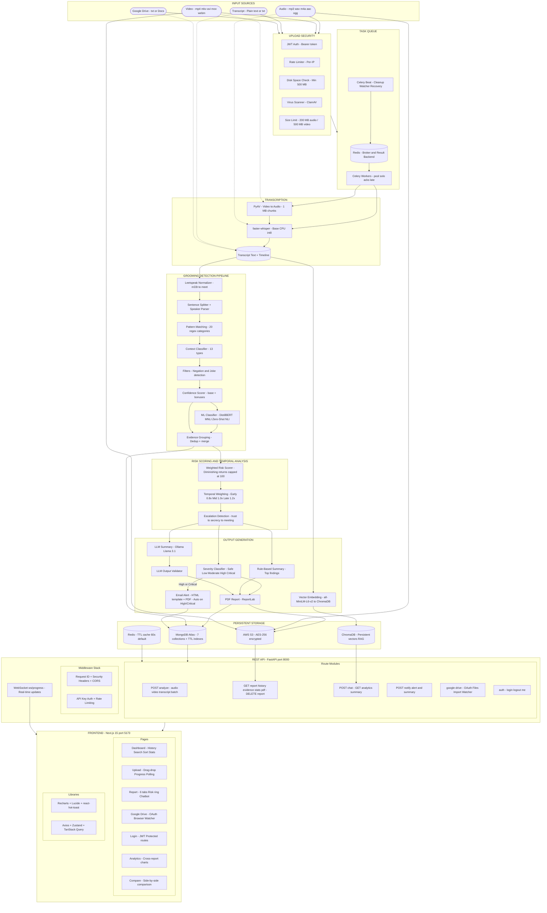

# Melody Wings Safety — AI-Powered Audio Grooming Detection

> Detect grooming, manipulation, and harmful language in audio conversations using a multi-stage AI pipeline — regex patterns, context classification, ML zero-shot NLI, temporal weighting, LLM summaries, email alerts, real-time WebSocket progress, and a RAG chatbot.


---

## What It Does

Melody Wings Safety accepts audio files, video files, plain-text transcripts, or Google Drive documents, and runs them through a layered detection pipeline that identifies **20 categories** of harmful behaviour — from grooming tactics and manipulation to explicit content, threats, gift-bribery, isolation, emotional exploitation, and age deception.

Every finding is scored, grouped, and surfaced in a Next.js dashboard with confidence breakdowns, ML analysis, temporal weighting, a timeline view, cross-report analytics, side-by-side comparison, and a downloadable PDF report. High-severity results trigger automatic email alerts. Real-time WebSocket progress updates keep the dashboard informed during analysis.

All data is persisted to MongoDB (7 core collections, plus `users` and `counters` for auth and IDs) and AWS S3. Background processing is handled by Celery + Redis with a threading fallback for local dev.

---

## Key Features (v2.1.0)

- **Multi-input support** — Audio (.mp3/.wav/.m4a/.aac/.ogg), Video (.mp4/.mkv/.avi/.mov/.webm/.flv/.wmv), plain-text transcripts, Google Drive imports
- **20-category detection** — Compiled regex patterns covering the full grooming lifecycle
- **ML zero-shot NLI** — DistilBERT-MNLI classifier fused at 25% weight with regex confidence
- **Temporal weighting** — Late-conversation findings score higher; clustering and escalation detection
- **Leetspeak normalization** — Catches obfuscated text (m33t, s3cr3t, separator insertion)
- **Circuit breaker pattern** — Graceful degradation for Ollama and S3 failures
- **Celery task queue** — Redis-backed background processing with threading fallback
- **Real-time WebSocket progress** — Live analysis stage updates pushed to the frontend
- **Virus scanning** — ClamAV integration for uploaded file safety
- **Disk space pre-check** — Rejects uploads when disk is low
- **Credential encryption** — Google OAuth tokens encrypted at rest (Fernet/AES)
- **Database migrations** — Versioned, tracked MongoDB schema changes
- **Rate limiting** — Per-IP request throttling middleware
- **Security headers** — CSP, X-Frame-Options, HSTS-ready
- **JWT authentication** — bcrypt-hashed passwords, httpOnly cookies, configurable expiry
- **Account lockout** — Configurable max failed attempts and lockout duration
- **Batch upload** — Analyze multiple files in a single request
- **RAG chatbot** — ChromaDB + Ollama for per-report Q&A
- **Email alerts** — Auto-triggered on High/Critical severity with PDF attachment
- **PDF reports** — Downloadable analysis reports via ReportLab
- **Google Drive watcher** — Auto-import new files on a configurable polling interval
- **Cross-report analytics** — Aggregated statistics across all analyses
- **Report comparison** — Side-by-side comparison of multiple reports
- **Command palette** — Keyboard-driven navigation and report search (Ctrl+K)
- **Real-time notifications** — In-app notification bell with WebSocket updates
- **Keyboard shortcuts** — Quick navigation (Ctrl+K search, Ctrl+N new analysis)

---

## Architecture



---

## Repository Structure

```
Melody Wings Safety/
├── backend/                        # FastAPI + Python detection pipeline
│   ├── app.py                      # Main FastAPI app — routes, middleware, startup/shutdown
│   ├── auth.py                     # JWT authentication — login, token validation, get_current_user
│   ├── config.py                   # Paths, SMTP, S3, MongoDB, Google Drive config
│   ├── celery_app.py               # Celery configuration — Redis broker, threading fallback
│   ├── celery_beat_schedule.py     # Periodic task schedule (cleanup, watcher)
│   ├── create_admin.py             # CLI script to create/reset admin user in MongoDB
│   ├── finetune_model.py           # Fine-tune the NLI model on custom grooming data
│   ├── requirements.txt            # Python dependencies
│   ├── start.bat                   # Windows one-click server start
│   ├── Dockerfile                  # Multi-stage Docker build
│   ├── .env.example                # Environment variable template
│   │
│   ├── api/                        # Route modules (versioned + auth + notifications)
│   │   ├── audio_analysis_routes.py    # /api/v1/* — analyze, batch, history, report, chat
│   │   ├── google_drive_routes.py      # /api/v1/google-drive/* — OAuth, files, import, watcher
│   │   ├── auth_routes.py             # /auth/* — login, logout, me
│   │   ├── notification_routes.py     # /api/v1/notify/* — alert + summary emails
│   │   └── analytics_routes.py        # /api/v1/analytics/* — cross-report aggregation
│   │
│   ├── tasks/                      # Celery task definitions
│   │   ├── analysis_tasks.py       # Audio, video, transcript, Drive import pipelines
│   │   └── maintenance_tasks.py    # Cleanup, watcher polling, stuck-job recovery
│   │
│   ├── services/                   # Business logic services
│   │   ├── audio_safety_service.py     # Async pipeline orchestration
│   │   └── google_drive_service.py     # Google OAuth2 + Drive/Docs file access
│   │
│   ├── schemas/                    # Pydantic models
│   │   └── audio_analysis_schemas.py   # Request/response schemas
│   │
│   ├── middleware/                 # HTTP middleware
│   │   └── rate_limiter.py         # Per-IP rate limiting
│   │
│   ├── modules/                    # Core detection + infrastructure modules (31 files)
│   │   ├── patterns.py             # 20-category compiled regex library
│   │   ├── grooming_detector.py    # Main pipeline orchestrator
│   │   ├── ml_classifier.py        # Zero-shot NLI (DistilBERT-MNLI)
│   │   ├── analysis_pipeline.py    # Unified pipeline (Celery entry point)
│   │   ├── temporal_weighting.py   # Position + clustering + escalation scoring
│   │   ├── cache.py                # Redis-backed TTL cache
│   │   ├── circuit_breaker.py      # Circuit breaker for external services
│   │   ├── websocket_manager.py    # Real-time WebSocket progress
│   │   └── ...                     # See backend/README.md for full list
│   │
│   ├── database/
│   │   ├── mongo.py                # MongoDB client — 7-collection schema + read helpers
│   │   └── migrations.py           # Versioned database migration system
│   │
│   └── models/
│       └── grooming-nli-finetuned/ # Fine-tuned DistilBERT model checkpoints
│
├── admin-next/                     # Next.js 15 dashboard (App Router)
│   ├── src/app/
│   │   ├── (app)/                  # Protected route group
│   │   │   ├── page.jsx            # Dashboard — history table, stats, filters
│   │   │   ├── upload/page.jsx     # Audio/video/transcript upload
│   │   │   ├── report/[id]/page.jsx  # 6-tab report + Chatbot sidebar
│   │   │   ├── google-drive/page.jsx # Google Drive OAuth2 + file browser + watcher
│   │   │   ├── analytics/page.jsx  # Cross-report analytics (12 chart types)
│   │   │   ├── compare/page.jsx    # Side-by-side report comparison
│   │   │   └── layout.jsx          # Nav, auth guard, notifications, command palette
│   │   ├── login/page.jsx          # JWT login page
│   │   └── layout.jsx              # Root layout (providers, toaster)
│   ├── src/components/
│   │   ├── Chatbot.jsx             # AI chatbot sidebar (RAG)
│   │   ├── CommandPalette.jsx      # Keyboard-driven search + navigation (Ctrl+K)
│   │   ├── NotificationProvider.jsx  # Real-time notification system
│   │   ├── ErrorBoundary.jsx       # Error boundary
│   │   └── Providers.jsx           # TanStack Query + Toaster
│   ├── src/hooks/
│   │   ├── useKeyboardShortcuts.js # Global keyboard shortcut handler
│   │   └── useWebSocket.js         # WebSocket connection hook
│   ├── src/lib/api.js              # Axios client — all API calls + SSR-safe auth helpers
│   ├── src/store/dataStore.js      # Zustand global state (history + analytics)
│   └── next.config.js              # API rewrites /api/v1/* → :8000
│
└── docker-compose.yml              # Full stack: Redis, Backend, Celery, Frontend, ClamAV, Ollama
```

---

## Quick Start

### Prerequisites

- Python 3.10+
- Node.js 18+
- Redis *(optional — for Celery task queue and caching; falls back to threading + in-memory)*
- [Ollama](https://ollama.com) *(optional — for LLM summaries and chatbot)*

### 1. Clone

```bash
git clone https://github.com/umangjzx/transcript-Analysis.git
cd transcript-Analysis
```

### 2. Backend

```bash
cd backend

python -m venv venv

# Windows
venv\Scripts\activate
# macOS / Linux
source venv/bin/activate

pip install -r requirements.txt

# Copy and fill in environment variables
cp .env.example .env

# Create the admin user (required for JWT auth)
python create_admin.py

# Start the server
uvicorn app:app --host 0.0.0.0 --port 8000 --reload
```

On Windows you can also use the included batch script:

```bash
start.bat
```

Backend runs at **http://localhost:8000**
- Swagger UI: http://localhost:8000/docs
- ReDoc: http://localhost:8000/redoc

### 3. Celery Workers (optional, recommended)

```bash
# Start a Celery worker (processes analysis tasks in background)
celery -A celery_app worker --loglevel=info --pool=solo

# Start Celery Beat (periodic tasks: cleanup, watcher)
celery -A celery_app beat --loglevel=info
```

If Redis is not available, set `USE_CELERY=false` in `.env` — tasks will run synchronously via threading.

### 4. Frontend

```bash
cd admin-next
npm install
npm run dev
```

Frontend runs at **http://localhost:5173**

### 5. Ollama (optional)

```bash
ollama pull llama3.1
```

If Ollama is not running, the system falls back to the rule-based summary. All other features work without it.

---

## Docker Deployment

Run the full stack with Docker Compose:

```bash
# Core services (Redis, Backend, Celery Worker, Celery Beat, Frontend)
docker compose up -d

# Full stack including ClamAV and Ollama
docker compose --profile full up -d
```

Services:
| Service | Port | Description |
|---|---|---|
| `rmsi-redis` | 6379 | Redis — cache + Celery broker |
| `rmsi-backend` | 8000 | FastAPI application |
| `rmsi-celery-worker` | — | Background task processing |
| `rmsi-celery-beat` | — | Periodic task scheduler |
| `rmsi-frontend` | 3000 | Next.js app |
| `rmsi-clamav` | 3310 | Virus scanning (profile: full) |
| `rmsi-ollama` | 11434 | LLM summaries (profile: full) |

---

## Environment Variables

Copy `backend/.env.example` to `backend/.env`. All integrations are optional — the core analysis pipeline runs without them.

Key sections:
- **Authentication** — JWT_SECRET, JWT_EXPIRE_MINUTES, API_KEY, COOKIE_SECURE, LOCKOUT_MAX_ATTEMPTS
- **MongoDB** — MONGO_URI, MONGO_DB_NAME, connection pool settings
- **Redis/Celery** — REDIS_URL, CELERY_BROKER_URL, USE_CELERY
- **AWS S3** — credentials, region, bucket name
- **SMTP Email** — host, port, user, password, recipients, severity threshold
- **Feature flags** — ENABLE_ML_CLASSIFIER, ENABLE_LLM_SUMMARY, upload limits
- **Google Drive** — OAuth credentials, watcher settings, encryption key
- **Security** — ALLOWED_ORIGINS, virus scanning, circuit breaker, disk space
- **Operations** — log rotation, TTL indexes, structured logging

See `backend/.env.example` for the full documented list.

> **Gmail tip:** Generate a 16-character App Password at https://myaccount.google.com/apppasswords — 2FA must be enabled first.

---

## Detection Categories

The pipeline detects **20 categories** across the full grooming lifecycle:

### Critical Severity
| Category | Weight | Description |
|---|---|---|
| `explicit_content` | 25 | Sexual solicitation, nude requests, sexting |
| `threats_coercion` | 22 | Blackmail, photo threats, reputation threats |
| `meeting` | 20 | Arranging in-person contact |
| `address` | 20 | Requesting physical location |
| `emotional_exploitation` | 18 | Guilt-tripping, self-harm threats as control |
| `isolation` | 16 | Discrediting friends/family |
| `secrecy` | 15 | "Don't tell anyone", "delete messages" |
| `manipulation` | 10 | Coercion, conditional threats |

### High Severity
| Category | Weight | Description |
|---|---|---|
| `personal_information` | 18 | Phone, email, social handles |
| `parent_monitoring` | 15 | Questions about parental supervision |
| `age_deception` | 14 | "Age is just a number" |
| `desensitization` | 14 | "It's normal", "everyone does it" |
| `gift_bribery` | 12 | Gift offers, money, gaming currency |
| `video_call` | 10 | Camera requests, selfie demands |
| `school` | 10 | School name, grade, dismissal time |
| `routine` | 10 | Daily schedule, when alone at home |
| `relationship_building` | 5 | "You're special to me" |

### Medium Severity
| Category | Weight | Description |
|---|---|---|
| `gaming_luring` | 10 | "Join my private server", moving to DMs |
| `bad_language` | 8 | Profanity, slurs, hate speech |
| `trust_building` | 5 | "Trust me", "I'm here for you" |

---

## Risk Scoring

Risk scores are calculated on a **0–100 scale** using a weighted, diminishing-returns formula with temporal weighting:

```
effective_score = weight × confidence × temporal_multiplier
total_score     = Σ effective_scores, capped at 100
```

**Temporal weighting** — findings in the last 25% of a conversation receive a 1.2x multiplier. Clustering bonus (+0.15) for 3+ findings within 10% of conversation. Escalation bonus (+0.20) when severity increases over time.

**Diminishing returns** — repeated occurrences of the same category: 100% → 50% → 25% → 12.5% → …

| Risk Level | Score Range |
|---|---|
| Safe | 0–20 |
| Low | 21–40 |
| Moderate | 41–60 |
| High | 61–80 |
| Critical | 81–100 |

---

## Tech Stack

| Layer | Technology |
|---|---|
| API | FastAPI 0.136 + Uvicorn 0.47 |
| Task Queue | Celery 5.4 + Redis (threading fallback) |
| Transcription | Faster-Whisper 1.2 (base model, CPU, int8) |
| Video Extraction | PyAV (streamed, 1 MB chunks) |
| Pattern Detection | Python `re` — 20 compiled regex categories |
| Text Normalization | Leetspeak normalizer |
| ML Classifier | DistilBERT-MNLI — Zero-Shot NLI |
| LLM Summary | Ollama — Llama 3.1 (with output validation) |
| Vector Store | ChromaDB (persistent) |
| Embeddings | SentenceTransformers `all-MiniLM-L6-v2` |
| Primary Database | MongoDB Atlas — 7 collections + versioned migrations |
| Caching | Redis-backed TTL cache (in-memory fallback) |
| File Storage | AWS S3 — AES-256 encrypted |
| Virus Scanning | ClamAV via pyclamd |
| Email | SMTP — HTML alert + summary templates |
| PDF | ReportLab |
| Google Drive | Google Drive API + Docs API (OAuth2, encrypted credentials) |
| Real-time | WebSocket (/ws/progress) |
| Authentication | JWT (HS256) + bcrypt + httpOnly cookies |
| Frontend | Next.js 15 (App Router) |
| State Management | Zustand 5 + TanStack Query 5 |
| Charts | Recharts 3 |
| Icons | Lucide React |
| Notifications | react-hot-toast + WebSocket notifications |
| Containerization | Docker Compose (6 services) |

---

## API Reference

### Core Routes

| Method | Path | Description |
|---|---|---|
| `GET` | `/health` | Full health check — MongoDB, S3, Redis, Ollama, Whisper, ChromaDB, disk |
| `POST` | `/analyze` | Upload audio — background pipeline via Celery |
| `POST` | `/analyze/video` | Upload video — audio extracted, then analyzed |
| `POST` | `/analyze/transcript` | Submit plain-text transcript (JSON or multipart) |
| `GET` | `/report/{id}/status` | Poll: `PROCESSING` / `COMPLETED` / `FAILED` |
| `GET` | `/history` | Paginated history with TTL cache |
| `GET` | `/report/{id}` | Full report |
| `DELETE` | `/report/{id}` | Delete from MongoDB + S3 + local + ChromaDB |
| `POST` | `/chat` | RAG chatbot |
| `WS` | `/ws/progress` | Real-time analysis progress updates |

### Versioned Routes (/api/v1)

| Method | Path | Description |
|---|---|---|
| `POST` | `/api/v1/analyze` | Synchronous analysis (Pydantic response) |
| `POST` | `/api/v1/analyze/batch` | Batch upload — multiple files |
| `GET` | `/api/v1/analytics/summary` | Cross-report aggregation |

### Authentication

| Method | Path | Description |
|---|---|---|
| `POST` | `/auth/login` | JWT login |
| `POST` | `/auth/logout` | Logout (clears cookie) |
| `GET` | `/auth/me` | Current user info |

### Google Drive

| Method | Path | Description |
|---|---|---|
| `GET` | `/api/v1/google-drive/auth-url` | OAuth2 consent URL |
| `GET` | `/api/v1/google-drive/files` | List importable files |
| `POST` | `/api/v1/google-drive/import` | Import and analyze |
| `POST` | `/api/v1/google-drive/watcher/start` | Start auto-import |

### Examples

```bash
# Upload and analyze audio
curl -X POST http://localhost:8000/analyze -F "file=@conversation.mp3"

# Submit transcript
curl -X POST http://localhost:8000/analyze/transcript \
  -H "Content-Type: application/json" \
  -d '{"transcript": "Speaker A: keep this between us...", "filename": "chat.txt"}'

# Get full report
curl http://localhost:8000/report/12

# Ask chatbot
curl -X POST http://localhost:8000/chat \
  -H "Content-Type: application/json" \
  -d '{"report_id": 12, "question": "What secrecy phrases were used?"}'
```

---

## Security Features

- **JWT authentication** with bcrypt-hashed passwords and httpOnly cookies
- **Account lockout** — configurable max attempts and lockout duration
- **Rate limiting** middleware (per-IP, configurable thresholds)
- **Security headers** — CSP, X-Frame-Options, X-Content-Type-Options, Referrer-Policy
- **CORS** locked to configured origins
- **Virus scanning** via ClamAV (configurable fail-open/fail-closed)
- **Credential encryption** — Google OAuth tokens encrypted at rest with Fernet
- **Disk space pre-check** before accepting uploads
- **Circuit breaker** prevents cascading failures from external services
- **Request correlation IDs** (X-Request-ID header) for tracing
- **Audit logging** — all actions tracked in MongoDB with TTL expiry
- **Secure file handling** — UUID disk names, streaming uploads, size limits
- **Database migrations** — versioned schema changes with JSON Schema validation
- **Structured logging** — JSON format in production with log rotation

---

## Utility Scripts

| Script | Description |
|---|---|
| `python test_pipeline.py` | Interactive CLI — run text through the full detection pipeline |
| `python test_email.py` | 4-step SMTP integration test |
| `python debug_env.py` | Low-level SMTP credential debugger |
| `python examples/run_test_scripts.py` | Run test scripts through the pipeline |
| `python create_admin.py` | Create or reset the admin user in MongoDB |
| `python finetune_model.py` | Fine-tune the NLI model on custom grooming data |

---

## Contributing

1. Fork the repository
2. Create a feature branch: `git checkout -b feature/your-feature`
3. Commit your changes: `git commit -m "add: your feature"`
4. Push to the branch: `git push origin feature/your-feature`
5. Open a pull request

---

## License

MIT License — see [LICENSE](LICENSE) for details.
