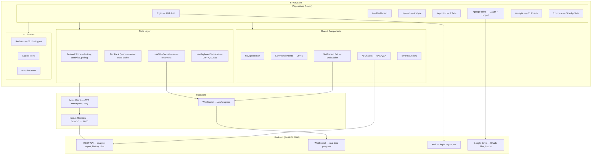

# Melody Wings Safety — Frontend (Next.js 15)

The admin dashboard for Melody Wings Safety. Built with Next.js 15 (App Router), Zustand, Recharts, and Axios.

---

## Architecture



---

## Quick Start

```bash
# Install dependencies
npm install

# Copy environment file
cp .env.local.example .env.local

# Start dev server (port 5173)
npm run dev
```

Open **http://localhost:5173** — the backend must be running on port 8000 for API calls to work.

---

## Scripts

| Command | Description |
|---------|-------------|
| `npm run dev` | Start dev server on port 5173 |
| `npm run build` | Production build |
| `npm run start` | Start production server |
| `npm run lint` | Run Next.js lint |

---

## Tech Stack

| Layer | Technology |
|-------|-----------|
| Framework | Next.js 15 (App Router) |
| UI | React 19 |
| State | Zustand 5 |
| Data Fetching | TanStack Query 5 + Axios |
| Charts | Recharts 3 (11 chart types + per-report analytics) |
| Icons | Lucide React |
| Notifications | react-hot-toast |
| Real-time | Custom WebSocket hook |

---

## Project Structure

```
admin-next/
├── public/                         # Static assets
│   ├── favicon.svg
│   ├── icons.svg
│   └── unnamed.png                 # Logo
├── src/
│   ├── app/
│   │   ├── layout.jsx             # Root layout (Providers, fonts, metadata)
│   │   ├── globals.css            # Global theme (CSS variables, utilities)
│   │   ├── app-components.css     # Component-specific styles
│   │   ├── login/page.jsx         # Public login page
│   │   └── (app)/                 # Protected route group
│   │       ├── layout.jsx         # Nav, auth guard, notifications, command palette
│   │       ├── page.jsx           # Dashboard — history table, stats, filters
│   │       ├── upload/page.jsx    # Audio/video/transcript upload
│   │       ├── report/[id]/page.jsx  # Full report viewer (6 tabs)
│   │       ├── google-drive/page.jsx # Google Drive OAuth + file browser
│   │       ├── analytics/page.jsx # 11 chart types + AI insights
│   │       └── compare/page.jsx   # Side-by-side report comparison
│   ├── components/
│   │   ├── Chatbot.jsx            # RAG chatbot (per report)
│   │   ├── CommandPalette.jsx     # Ctrl+K search + navigation
│   │   ├── ErrorBoundary.jsx      # Error boundary fallback
│   │   ├── NotificationProvider.jsx # WebSocket notification bell
│   │   └── Providers.jsx          # TanStack Query + Toaster
│   ├── hooks/
│   │   ├── useKeyboardShortcuts.js # Global hotkeys (Ctrl+K, N, arrows)
│   │   └── useWebSocket.js        # Auto-reconnecting WebSocket
│   ├── lib/
│   │   └── api.js                 # Axios client, all API functions, auth helpers
│   └── store/
│       └── dataStore.js           # Zustand global state (history + analytics)
├── next.config.js                  # API rewrites to backend
├── Dockerfile                      # Multi-stage production Docker build
├── .dockerignore
├── .env.local.example              # Environment variable template
├── jsconfig.json                   # Path aliases (@/ → src/)
└── package.json
```

---

## Pages

| Route | Description |
|-------|-------------|
| `/login` | JWT authentication form |
| `/` | Dashboard — analysis history table with search, sort, filters, bulk delete, CSV export |
| `/upload` | Upload audio/video files or paste/upload transcript text |
| `/report/:id` | Full report — 6 tabs (Overview with score calculation breakdown, Findings Debugger, Evidence, Timeline, Analytics with temporal phase chart, Raw JSON) + AI chatbot |
| `/google-drive` | Google Drive OAuth2, file browser, import for analysis, auto-watcher |
| `/analytics` | 11 chart types (severity, risk distribution, categories, confidence, trend, ML agreement, ML calibration, volume, avg/day, risk by weekday, severity trend) + AI insights |
| `/compare` | Side-by-side comparison of 2 reports (scores, findings, categories) |

---

## Features

- **JWT auth** with cross-tab sync and auto-redirect on 401
- **Real-time updates** via WebSocket (analysis progress, completion, failure)
- **Optimistic mutations** — delete/add appears instantly, reverts on failure
- **Command palette** (Ctrl+K) — fuzzy search reports + quick actions
- **Keyboard shortcuts** — N (new analysis), arrows (table nav), Delete
- **Background polling** — auto-refreshes when reports are PROCESSING
- **PDF download** — one-click PDF report generation
- **Email alerts** — send alert or summary email from report page
- **Bulk operations** — multi-select, bulk delete, CSV export, compare 2
- **Notification bell** — real-time notification dropdown with history
- **AI chatbot** — per-report RAG Q&A (Ollama + ChromaDB)
- **AI insights** — LLM-generated analytics explanation
- **Score calculation breakdown** — visible in the report page overview tab
- **Chart toggle** — show/hide individual charts (persisted in localStorage)

---

## Design System

The UI uses a professional light theme with:
- Single indigo accent family (`#4f46e5` / `#6366f1`)
- Soft gray canvas (`#f5f7fa`) with white card surfaces
- Subtle neutral shadows (no glows or animated blobs)
- Calm motion (standard ease curves, small hover lifts)
- Tighter border radii (6/10/14px)
- Inter + Outfit font pairing

---

## Environment Variables

Copy `.env.local.example` to `.env.local`:

| Variable | Default | Description |
|----------|---------|-------------|
| `BACKEND_URL` | `http://localhost:8000` | Backend URL used by Next.js rewrites (server-side) |
| `NEXT_PUBLIC_API_BASE` | `/api/v1` | Base path for client-side API calls |
| `NEXT_PUBLIC_WS_URL` | auto-derived | WebSocket URL (override for different origins) |
| `NEXT_PUBLIC_API_KEY` | — | Optional legacy X-API-Key header |

---

## API Proxy

`next.config.js` rewrites handle the proxy to the backend (same pattern as the original Vite proxy):

| Frontend Path | Backend Destination |
|---------------|-------------------|
| `/api/v1/google-drive/*` | `http://localhost:8000/api/v1/google-drive/*` |
| `/api/v1/analytics/*` | `http://localhost:8000/api/v1/analytics/*` |
| `/api/v1/chat` | `http://localhost:8000/api/v1/chat` |
| `/api/v1/notify/*` | `http://localhost:8000/api/v1/notify/*` |
| `/api/v1/*` | `http://localhost:8000/*` (prefix stripped) |
| `/auth/*` | `http://localhost:8000/auth/*` |

---

## Docker

```bash
# Build standalone
docker build -t melody-wings-frontend .

# Run
docker run -p 3000:3000 -e BACKEND_URL=http://backend:8000 melody-wings-frontend
```

Or via docker-compose from the project root:

```bash
docker compose up frontend
```

---

## Migration Notes

This app replaces the original React + Vite frontend (`frontend/` directory, now deleted). Key changes:

| Aspect | Before (React/Vite) | Now (Next.js) |
|--------|---------------------|---------------|
| Framework | React 19 + Vite 8 | Next.js 15 (App Router) |
| Routing | react-router-dom v7 | File-based (App Router) |
| State | React Context | Zustand 5 |
| Proxy | Vite dev proxy | next.config.js rewrites |
| Code splitting | React.lazy() | Automatic per-route |
| Build output | Static SPA (Nginx) | Node.js standalone server |
| Docker | Nginx serving static files | Node.js standalone (port 3000) |
