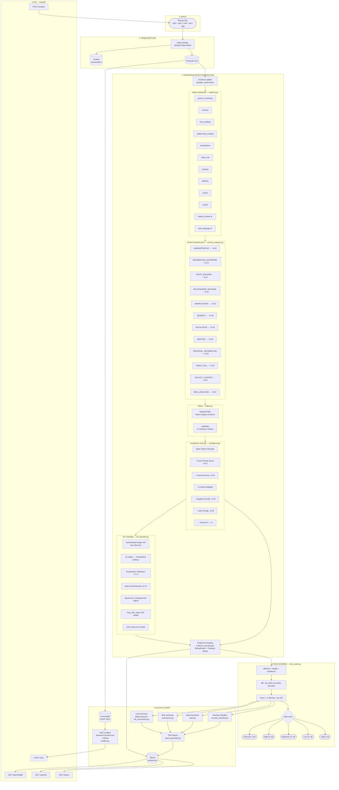

# Audio Safety Analyzer

A production-grade backend system for detecting grooming behaviour, explicit content, and harmful language in audio conversations. Supports Discord voice chats, WhatsApp calls, Zoom meetings, gaming voice chats, podcasts, workplace calls, and any general audio source.

---

## Architecture



---

## Table of Contents

- [Overview](#overview)
- [Tech Stack](#tech-stack)
- [Project Structure](#project-structure)
- [Detection Categories](#detection-categories)
- [Context Classification](#context-classification)
- [Confidence Scoring](#confidence-scoring)
- [ML Classifier](#ml-classifier)
- [Risk Scoring](#risk-scoring)
- [Filters](#filters)
- [Evidence Grouping](#evidence-grouping)
- [Modules Reference](#modules-reference)
- [API Endpoints](#api-endpoints)
- [Database Schema](#database-schema)
- [Running the Server](#running-the-server)
- [Interactive Pipeline Tester](#interactive-pipeline-tester)
- [Design Principles](#design-principles)
- [Configuration](#configuration)

---

## Overview

The Audio Safety Analyzer processes audio files through a multi-stage pipeline:

1. **Transcribe** audio using Faster-Whisper
2. **Detect** harmful patterns across 12 categories using compiled regex
3. **Classify** the semantic context of each sentence (not the speaker's role)
4. **Filter** false positives caused by negation or jokes
5. **Score** confidence per finding using context multipliers
6. **Classify (ML)** each finding with a zero-shot NLI model — 13 labels, agreement signal, confidence fusion
7. **Group** duplicate evidence across categories
8. **Score** overall risk on a 0–100 weighted scale
9. **Summarize** findings with both rule-based and LLM (Llama 3.1) summaries
10. **Persist** results to SQLite and vectors to ChromaDB
11. **Generate** a PDF report
12. **Serve** everything through a FastAPI REST API with a RAG chatbot

> **No role-based assumptions.** The system never adjusts scores based on speaker labels like "teacher", "parent", or "admin". It evaluates *what is said*, not *who says it*.

---

## Tech Stack

| Layer | Technology |
|---|---|
| API Framework | FastAPI |
| Audio Transcription | Faster-Whisper (Whisper Base, CPU, int8) |
| Pattern Detection | Python `re` — compiled regex |
| ML Classifier | `typeform/distilbert-base-uncased-mnli` — Zero-Shot NLI via HuggingFace Transformers |
| LLM Summary | Ollama — Llama 3.1 |
| Vector Store | ChromaDB (persistent) |
| Embeddings | SentenceTransformers `all-MiniLM-L6-v2` |
| Database | SQLite via SQLAlchemy ORM |
| PDF Generation | `report_generator.py` |
| Runtime | Python 3.10+ |

---

## Project Structure

```
backend/
│
├── app.py                          # FastAPI application entry point
├── config.py                       # Upload folder, DB URL, allowed extensions
├── requirements.txt                # Python dependencies
├── test_pipeline.py                # Interactive CLI pipeline tester
│
├── api/
│   └── audio_analysis_routes.py   # Route definitions (v2)
│
├── services/
│   └── audio_safety_service.py    # Business logic orchestration
│
├── schemas/
│   └── audio_analysis_schemas.py  # Pydantic request/response models
│
├── modules/
│   ├── patterns.py                # All regex pattern libraries (12 categories)
│   ├── context_analyzer.py        # ContextType enum + multipliers
│   ├── confidence.py              # Confidence scoring engine
│   ├── filters.py                 # NegationFilter + JokeFilter
│   ├── ml_classifier.py           # Zero-shot NLI classifier (bart-large-mnli)
│   ├── evidence_grouping.py       # Deduplication + category merging
│   ├── grooming_detector.py       # Main detection pipeline orchestrator
│   ├── risk_scorer.py             # Weighted risk scoring + diminishing returns
│   ├── severity_classifier.py     # Score → Safe/Medium/Critical label
│   ├── summarizer.py              # Rule-based summary generator
│   ├── llm_summarizer.py          # Ollama Llama 3.1 summary
│   ├── report_generator.py        # PDF report generation
│   ├── transcriber.py             # Faster-Whisper transcription
│   ├── evidence_extractor.py      # Evidence list extraction
│   ├── stats.py                   # Statistics generation
│   ├── chatbot.py                 # RAG chatbot (ChromaDB + Ollama)
│   └── analyzer.py                # Legacy analyzer
│
├── database/
│   ├── db.py                      # SQLAlchemy engine + session
│   └── models.py                  # AudioAnalysis ORM model
│
├── uploads/                        # Uploaded audio files
├── reports/                        # Generated PDF reports
├── vectors/                        # ChromaDB persistent vector store
└── logs/
    └── app.log                    # Application logs
```

---

## Detection Categories

The system detects 12 categories. Each has a base confidence, severity level, and risk weight.

| Category | Severity | Base Confidence | Risk Weight | Description |
|---|---|---|---|---|
| `meeting` | Critical | 0.95 | 20 | Arranging in-person contact |
| `address` | Critical | 0.90 | 20 | Requesting physical location or address |
| `secrecy` | Critical | 0.95 | 15 | Demands to hide, delete, or not disclose |
| `parent_monitoring` | High | 0.85 | 15 | Questions about parental supervision |
| `explicit_content` | **Critical** | **0.98** | **25** | Sexual solicitation, explicit language, nude requests |
| `school` | High | 0.75 | 10 | School name, grade, dismissal time |
| `routine` | High | 0.80 | 10 | Daily schedule, walk home, route |
| `video_call` | High | 0.80 | 10 | Video call requests, camera requests |
| `manipulation` | Critical | 0.90 | 10 | Coercion, conditional threats, peer pressure |
| `bad_language` | Medium | 0.85 | 8 | Profanity, slurs, threats, harassment |
| `trust_building` | Medium | 0.80 | 5 | Emotional trust establishment |
| `relationship_building` | High | 0.75 | 5 | Deepening personal dependency |

### Explicit Content — what is detected

- Requests for nude or naked images/video
- Sexual acts — solicitation, descriptions, references
- Age-inappropriate sexual probing ("are you a virgin", "what are you wearing")
- Sexual language directed at a person ("I want to touch you", "you turn me on")
- Sexting / dirty talk / cybersex references
- CSAM references

### Bad Language — what is detected

- Common profanity (fuck, shit, bitch, asshole, cunt, etc.)
- Racial, ethnic, gender, and sexuality slurs
- Threats ("I'll kill you", "kill yourself", "go die")
- Harassment and degrading language ("you're a slut", "nobody likes you")

---

## Context Classification

Every sentence is classified into one or more `ContextType` values. The type drives a **confidence multiplier** that is added to the base pattern strength — no speaker identity is ever consulted.

```
ContextType          Multiplier   Meaning
─────────────────────────────────────────────────────────────────
ADMINISTRATIVE         −0.40      Event logistics, forms, schedules
                                  → suppresses false positives
INFORMATION_GATHERING  +0.15      Collecting personal details
TRUST_BUILDING         +0.20      "I care about you", "trust me"
RELATIONSHIP_BUILDING  +0.15      "special connection", "best friends"
MANIPULATION           +0.30      "they won't understand", coercion
SECRECY                +0.40      "don't tell anyone", "our secret"
ESCALATION             +0.35      Private call, move to another platform
MEETING                +0.35      Meet up, in person, hang out
PERSONAL_INFORMATION   +0.30      Address, phone, email, route
VIDEO_CALL             +0.25      Video chat, FaceTime, camera requests
EXPLICIT_CONTENT       +0.50      Sexual language (highest multiplier)
BAD_LANGUAGE           +0.20      Profanity, slurs, threats
NEUTRAL                 0.00      No strong signal
```

**Administrative suppression example:**
> "What time does the science exhibition finish?"
→ Classified as `ADMINISTRATIVE` (−0.40) → no findings above threshold → `Safe`

**Stacking example:**
> "let's have sex, keep this between us"
→ `EXPLICIT_CONTENT` (+0.50) + `SECRECY` (+0.40) = net multiplier +0.90
→ Both categories fire at maximum confidence

---

## Confidence Scoring

Each finding's confidence is computed as:

```
score = pattern_strength
      + exact_phrase_bonus      (+0.15 if matched text is a known exact phrase)
      + keyword_bonus           (+0.10 if ≥2 supporting keywords present)
      + context_multiplier      (from ContextType, −0.40 to +0.50)
      − negation_penalty        (up to −0.40, token-scoped)
      − joke_penalty            (up to −0.50, ±2 sentence window)

regex_confidence = clamp(score, 0.0, 1.0)

# ML fusion step (25% weight)
fused_confidence = 0.75 × regex_confidence + 0.25 × ml_category_score
```

The output includes a full breakdown:

```json
{
  "confidence": 0.9338,
  "context_type": "SECRECY",
  "breakdown": {
    "base_score": 0.95,
    "exact_match_bonus": 0.15,
    "keyword_bonus": 0.10,
    "context_multiplier": 0.40,
    "negation_penalty": 0.0,
    "joke_penalty": 0.0,
    "ml_fused_confidence": 0.9338,
    "ml_fusion_delta": -0.0662
  },
  "factors": ["exact_phrase_match", "multiple_keywords", "context:SECRECY"]
}
```

---

## Risk Scoring

The `WeightedRiskScorer` converts findings into a 0–100 score.

### Formula

```
effective_score = weight × confidence × diminishing_return_factor

total = Σ effective_scores
final = min(total, 100)
```

### Diminishing Returns (same category, repeated occurrences)

| Occurrence | Factor |
|---|---|
| 1st | 1.000 (full weight — never penalised) |
| 2nd | 0.500 |
| 3rd | 0.250 |
| 4th | 0.125 |
| 5th+ | continues halving |

### Risk Levels

| Level | Score Range |
|---|---|
| Safe | 0 – 20 |
| Low | 21 – 40 |
| Moderate | 41 – 60 |
| High | 61 – 80 |
| Critical | 81 – 100 |

### Example breakdown output

```
Risk Score : 67.50/100
Risk Level : High

Category Breakdown:
  • Explicit Content  : 24.50 pts  (1 occurrence, ctx: EXPLICIT_CONTENT)
  • Meeting           : 18.00 pts  (1 occurrence, ctx: MEETING)
  • Secrecy           : 15.00 pts  (1 occurrence, ctx: SECRECY)
  • Address           :  7.50 pts  (2 occurrences — DR applied on 2nd)
  • Trust Building    :  2.50 pts  (1 occurrence, ctx: TRUST_BUILDING)
```

---

## Filters

### NegationFilter (`filters.py`)

Negation is **token-scoped**: a negation word only suppresses a finding if it appears within **5 tokens** of the matched phrase. Negation in an unrelated clause does not affect the finding.

```
"I did not ask for your address"   → NEGATED   ("not" is 3 tokens from "address")
"I never lie but I want your address" → NOT negated ("never" is 7+ tokens away)
```

**Secrecy phrase exemption:** Phrases like "nobody needs to know" and "don't tell anyone" contain negation words as part of their threat meaning. These are exempt from the negation penalty.

### JokeFilter (`filters.py`)

Joke detection uses a **±2 sentence window**. If joke indicators appear in the current sentence or either neighbour, the confidence penalty is applied.

```
Indicators: lol, lmao, haha, just kidding, jk, obviously joking,
            everyone laughed, 😂 🤣 😆, as a joke, pulling your leg
```

Joke penalty: up to **−0.50** on confidence.

---

## Evidence Grouping

`EvidenceGroupingEngine` deduplicates findings when a single sentence matches multiple categories.

**Before grouping:**
```json
[
  {"category": "school",  "evidence": "What time do you leave school?"},
  {"category": "routine", "evidence": "What time do you leave school?"}
]
```

**After grouping:**
```json
{
  "categories": ["school", "routine"],
  "evidence": "What time do you leave school?",
  "max_confidence": 0.85,
  "avg_confidence": 0.80,
  "severity": "high",
  "category_details": [
    {"category": "school",  "confidence": 0.85},
    {"category": "routine", "confidence": 0.75}
  ]
}
```

---

## Modules Reference

### `patterns.py`
Compiled regex pattern library. Contains all 12 category pattern lists, `CATEGORY_METADATA`, `PATTERN_CONFIDENCE`, the `PATTERNS` dict, and the `match_patterns()` convenience function.

### `context_analyzer.py`
`ContextType` enum, `CONTEXT_MULTIPLIERS` dict, and `ContextAnalyzer` class. The `classify()` method returns the primary context type, all matched types, net multiplier, and matched terms per type. No speaker identity is used.

### `confidence.py`
`ConfidenceCalculator` class. Calls `ContextAnalyzer.classify()` internally. Returns full scoring breakdown including which factors were applied.

### `filters.py`
`NegationFilter` — token-distance scoped negation with secrecy phrase exemption.
`JokeFilter` — ±2 sentence window joke/sarcasm detection.
`CombinedFilter` — unified interface used by `GroomingDetector`.

### `grooming_detector.py`
`GroomingDetector` — main pipeline orchestrator. Calls patterns → context → filters → confidence → grouping. Speaker labels are stored in output for audit only and never used to adjust scores.

### `risk_scorer.py`
`WeightedRiskScorer` — weighted scoring with diminishing returns. Accepts single-category, multi-category grouped, and legacy finding formats. Surfaces `context_type` in breakdown output.

### `evidence_grouping.py`
`EvidenceGroupingEngine` — groups findings by evidence text, merges categories, calculates aggregate confidence and severity.

### `transcriber.py`
Wraps `faster-whisper` WhisperModel (base, CPU, int8). Returns `(transcript: str, timeline: List[dict])`.

### `llm_summarizer.py`
Calls Ollama `llama3.1` with a structured prompt. Returns executive summary, key concerns, high-risk behaviours, and recommended action. Fails gracefully if Ollama is unavailable.

### `chatbot.py`
RAG chatbot. Chunks transcript into sentence groups, embeds with `all-MiniLM-L6-v2`, stores in ChromaDB. At query time, retrieves top-5 relevant chunks and passes them to Ollama for grounded answers.

### `severity_classifier.py`
Maps risk score to a label: `score ≥ 80 → CRITICAL`, `score ≥ 40 → MEDIUM`, else `LOW`.

### `report_generator.py`
Generates a PDF report with findings, risk score, severity, and LLM summary.

### `stats.py`
Generates statistics dictionary from transcript, findings, severity, and risk score.

### `evidence_extractor.py`
Extracts a clean evidence list from grouped findings for the API response.

---

## API Endpoints

| Method | Path | Description |
|---|---|---|
| `GET` | `/` | Health check — returns service name |
| `GET` | `/health` | Detailed health status |
| `POST` | `/analyze` | Upload audio file, run full pipeline, return results |
| `GET` | `/history` | List all past analyses (id, filename, severity, risk_score) |
| `GET` | `/report/{id}` | Full report — transcript, findings, evidence, stats, summaries |
| `GET` | `/report/{id}/evidence` | Evidence list only |
| `GET` | `/report/{id}/stats` | Statistics only |
| `GET` | `/report/{id}/pdf` | Download PDF report |
| `POST` | `/chat` | Ask a question about a specific report (RAG chatbot) |

### POST `/analyze` — request

```bash
curl -X POST http://localhost:8000/analyze \
  -F "file=@conversation.mp3"
```

### POST `/analyze` — response shape

```json
{
  "id": 12,
  "filename": "conversation.mp3",
  "severity": "HIGH",
  "risk_score": 67.5,
  "transcript": "...",
  "timeline": [{"start": 0.0, "end": 3.2, "text": "..."}],
  "findings": [...],
  "evidence": [...],
  "stats": {...},
  "summary": "Rule-based summary...",
  "llm_summary": "LLM executive summary...",
  "pdf_report": "reports/report_12.pdf"
}
```

### POST `/chat` — request

```json
{
  "report_id": 12,
  "question": "What secrecy phrases were used?"
}
```

---

## Database Schema

```sql
CREATE TABLE audio_analysis (
    id          INTEGER PRIMARY KEY AUTOINCREMENT,
    filename    TEXT,
    transcript  TEXT,
    findings    TEXT,   -- JSON array
    evidence    TEXT,   -- JSON array
    stats       TEXT,   -- JSON object
    summary     TEXT,
    llm_summary TEXT,
    severity    TEXT,
    risk_score  REAL,
    pdf_path    TEXT
);
```

---

## Running the Server

### Prerequisites

```bash
# Python 3.10+
pip install -r requirements.txt

# Ollama (for LLM summary and chatbot) — optional
# Install from https://ollama.com then pull the model:
ollama pull llama3.1
```

### Start

```bash
uvicorn app:app --host 0.0.0.0 --port 8000 --reload
```

### API Docs

- Swagger UI: http://localhost:8000/docs
- ReDoc: http://localhost:8000/redoc

### Supported audio formats

`.mp3` `.wav` `.m4a` `.aac` `.ogg`

---

## Test Scripts

Two test transcripts are included to verify the full pipeline without needing an audio file:

```bash
python examples/run_test_scripts.py
```

| Script | Expected Result |
|---|---|
| `examples/test_script_bad.txt` | Score 100, CRITICAL, 23 findings across all 12 categories |
| `examples/test_script_good.txt` | Score 0, LOW, 0 findings |

Set `ENABLE_ML = True` in `run_test_scripts.py` to include the ML classifier layer (requires model cache, ~400 MB).

---

## Interactive Pipeline Tester

A CLI tool for testing any sentence or transcript through the full pipeline without uploading a file.

```bash
python test_pipeline.py
```

```
pipeline> keep this between us, nobody needs to know
pipeline> what time does the science exhibition finish?
pipeline> send me your nudes right now
pipeline> haha just kidding, lets meet up lol
pipeline> multi        ← enter multi-line transcript mode
```

Each input shows:

1. **Context Classification** — ContextType, multiplier, matched terms
2. **Negation / Joke Filter** — penalty applied, scoped negation terms
3. **Pattern Findings** — per-category confidence bar, scoring breakdown, flags
4. **Risk Score** — 0–100 bar, risk level, category breakdown with context types

---

## Design Principles

### No role-based assumptions

The system never adjusts confidence or risk based on who is speaking. There are no safe roles (teacher, parent, admin) and no trusted identities. The same sentence scores identically regardless of the speaker label attached to it.

> Speaker labels are stored in finding output for audit purposes only.

### Content-based context classification

Risk adjustment is driven entirely by *what is said*. Administrative language (event schedules, permission forms, registration) reduces confidence. Secrecy, manipulation, and explicit language increase it.

### Token-scoped negation

Negation only suppresses a finding when the negation word appears within 5 tokens of the matched phrase. A negation in an unrelated clause does not affect an unrelated risk signal in the same sentence.

### Secrecy phrase exemption

Phrases like "nobody needs to know" and "don't tell anyone" contain negation words as part of their threat meaning. These are explicitly exempt from the negation penalty.

### Diminishing returns on repetition

The first occurrence of any category always receives full weight. Repeated occurrences of the same category in the same conversation are progressively down-weighted (50%, 25%, 12.5%, …) to prevent a single repeated phrase from dominating the score.

### Joke filtering with context window

Joke detection looks ±2 sentences around the matched phrase, not just the current sentence. A joke indicator in a neighbouring sentence can suppress a finding in the current sentence.

---

## Configuration

```python
# config.py

UPLOAD_FOLDER      = "uploads"
DATABASE_URL       = "sqlite:///analysis.db"
ALLOWED_EXTENSIONS = [".mp3", ".wav", ".m4a", ".aac", ".ogg"]
```

```python
# grooming_detector.py — constructor defaults

GroomingDetector(
    min_confidence_threshold = 0.15,   # findings below this are dropped
    enable_context_analysis  = True,
    enable_filters           = True,
    enable_grouping          = True,
)
```

```python
# risk_scorer.py — weight overrides

scorer = WeightedRiskScorer(
    custom_weights = {"explicit_content": 30},
    enable_diminishing_returns = True,
)
```
