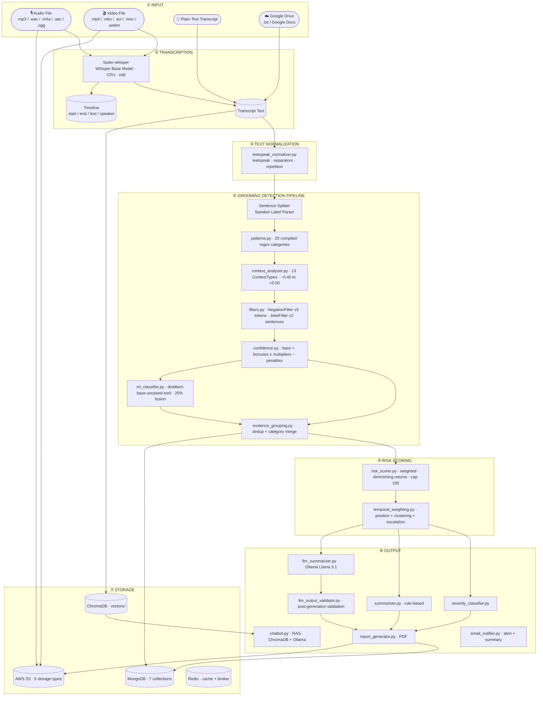

# Melody Wings Safety — Backend (v2.1.0)

Production-grade FastAPI backend for detecting grooming behaviour, explicit content, and harmful language in audio conversations. Supports audio files, video files, plain-text transcripts, and Google Drive imports. Works with Discord voice chats, WhatsApp calls, Zoom meetings, gaming voice chats, and any general audio/video source.

---

## Architecture



---

## Tech Stack

| Layer | Technology |
|---|---|
| API Framework | FastAPI 0.136 + Uvicorn 0.47 |
| Task Queue | Celery 5.4 + Redis (threading fallback when `USE_CELERY=false`) |
| Audio Transcription | faster-whisper 1.2 (Whisper Base, CPU, int8) |
| Video Audio Extraction | PyAV (streamed, never loads full file into memory) |
| Text Normalization | Leetspeak normalizer (character substitution, separator removal, repetition collapse) |
| Pattern Detection | Python `re` — 20 compiled regex categories |
| ML Classifier | `typeform/distilbert-base-uncased-mnli` — Zero-Shot NLI |
| LLM Summary | Ollama — Llama 3.1 (optional, graceful fallback) |
| Vector Store | ChromaDB (persistent) |
| Embeddings | SentenceTransformers `all-MiniLM-L6-v2` |
| Primary Database | MongoDB Atlas — 7 collections + versioned migrations |
| Caching | Redis-backed TTL cache (in-memory fallback) |
| File Storage | AWS S3 — 5 storage types, AES-256 encrypted |
| Virus Scanning | ClamAV via pyclamd |
| Email | SMTP (Gmail / any provider) — HTML alert + summary templates |
| PDF Generation | ReportLab |
| Google Drive | Google Drive API + Google Docs API (OAuth2, encrypted credentials) |
| Real-time Updates | WebSocket (/ws/progress) |
| Rate Limiting | Custom middleware (per-IP, configurable) |
| Circuit Breaker | Custom implementation for Ollama + S3 |
| Authentication | JWT (HS256) + bcrypt + httpOnly cookies |
| Runtime | Python 3.10+ |

---

## Authentication

### Strategy

- Admin credentials stored in MongoDB (`users` collection), passwords bcrypt-hashed (12 rounds)
- Login issues a signed JWT valid for `JWT_EXPIRE_MINUTES` (default 8 hours)
- `get_current_user` FastAPI dependency validates the Bearer JWT on protected routes
- JWT also set in httpOnly cookie (secure, not accessible via JavaScript)
- If `JWT_SECRET` is not set, auth is disabled (dev mode — all requests pass through)
- Server refuses to start without `JWT_SECRET` when `ENV=production`
- X-API-Key middleware kept for backward-compat with direct script access

### JWT payload

```json
{ "sub": "<username>", "role": "admin", "exp": <unix timestamp> }
```

### Auth endpoints

| Method | Path | Description |
|---|---|---|
| `POST` | `/auth/login` | `{"username": "...", "password": "..."}` → `{"access_token", "token_type", "username", "role"}` |
| `POST` | `/auth/logout` | Stateless logout (clears httpOnly cookie, audit logged) |
| `GET` | `/auth/me` | Current user from Bearer JWT (`Depends(get_current_user)`) |

### First-time setup

```bash
# 1. Add to .env:
JWT_SECRET=<python -c "import secrets; print(secrets.token_hex(32))">
JWT_EXPIRE_MINUTES=480

# 2. Create the admin user:
python create_admin.py
```

---

## Project Structure

```
backend/
│
├── app.py                          # FastAPI application — routes, middleware, startup/shutdown
├── config.py                       # Paths, SMTP, S3, MongoDB, Google Drive config
├── auth.py                         # JWT + bcrypt authentication helpers
├── celery_app.py                   # Celery configuration — Redis broker, threading fallback
├── celery_beat_schedule.py         # Periodic task schedule (cleanup, watcher)
├── create_admin.py                 # CLI script to create/reset admin user in MongoDB
├── finetune_model.py               # Fine-tune the NLI model on custom grooming data
├── requirements.txt                # Python dependencies
├── test_pipeline.py                # Interactive CLI pipeline tester
├── test_email.py                   # 4-step SMTP integration test
├── debug_env.py                    # Low-level SMTP credential debugger
├── run_server.py                   # Alternative uvicorn launcher
├── start.bat                       # Windows one-click server start
├── .env.example                    # Environment variable template
│
├── api/                            # Route modules
│   ├── audio_analysis_routes.py    # /api/v1/* — analyze, batch, history, report, chat
│   ├── google_drive_routes.py      # /api/v1/google-drive/* — OAuth, files, import, watcher
│   ├── auth_routes.py              # /auth/* — login, logout, me
│   ├── notification_routes.py      # /api/v1/notify/* — alert + summary emails
│   └── analytics_routes.py         # /api/v1/analytics/* — cross-report aggregation
│
├── tasks/                          # Celery task definitions
│   ├── __init__.py
│   ├── analysis_tasks.py           # Audio, video, transcript, Drive import pipelines
│   └── maintenance_tasks.py        # Cleanup, watcher polling, stuck-job recovery
│
├── services/
│   ├── audio_safety_service.py     # Async pipeline orchestration (sync /api/v1 path)
│   └── google_drive_service.py     # Google OAuth2 + Drive/Docs file access
│
├── schemas/
│   └── audio_analysis_schemas.py   # Pydantic request/response models
│
├── middleware/
│   ├── rate_limiter.py             # Per-IP rate limiting middleware
│   └── __init__.py
│
├── modules/
│   ├── patterns.py                 # 20-category compiled regex library
│   ├── context_analyzer.py         # ContextType enum + multipliers
│   ├── confidence.py               # Confidence scoring engine
│   ├── filters.py                  # NegationFilter + JokeFilter
│   ├── ml_classifier.py            # Zero-shot NLI (distilbert-mnli), LRU cache
│   ├── grooming_detector.py        # Main pipeline orchestrator
│   ├── evidence_grouping.py        # Deduplication + category merging
│   ├── risk_scorer.py              # Weighted risk scoring (0–100) + diminishing returns
│   ├── severity_classifier.py      # Score → Safe / Low / Moderate / High / Critical
│   ├── temporal_weighting.py       # Position-based + clustering + escalation scoring
│   ├── leetspeak_normalizer.py     # Obfuscation normalization (leetspeak, separators, repetition)
│   ├── analysis_pipeline.py        # Unified analysis pipeline (Celery entry point)
│   ├── summarizer.py               # Rule-based summary generator
│   ├── llm_summarizer.py           # Ollama Llama 3.1 summary
│   ├── llm_output_validator.py     # LLM output validation (post-generation)
│   ├── report_generator.py         # PDF report generation
│   ├── transcriber.py              # faster-whisper + PyAV video extraction
│   ├── evidence_extractor.py       # Evidence list extraction from grouped findings
│   ├── stats.py                    # Statistics + timeline + ML agreement
│   ├── chatbot.py                  # RAG chatbot (ChromaDB + Ollama)
│   ├── email_notifier.py           # SMTP alert + summary HTML emails
│   ├── s3_storage.py               # AWS S3 upload / presign / delete
│   ├── drive_watcher.py            # Google Drive background auto-import watcher
│   ├── cache.py                    # Redis-backed TTL cache with in-memory fallback
│   ├── circuit_breaker.py          # Circuit breaker for Ollama + S3
│   ├── credential_encryption.py    # Fernet encryption for OAuth credentials at rest
│   ├── virus_scanner.py            # ClamAV virus scanning for uploads
│   ├── disk_space_checker.py       # Pre-upload disk space validation
│   ├── websocket_manager.py        # Real-time WebSocket progress updates
│   └── file_cleanup.py             # Upload file cleanup daemon
│
├── database/
│   ├── mongo.py                    # MongoDB client — 7-collection schema + read helpers
│   └── migrations.py               # Versioned database migration system
│
├── models/
│   └── grooming-nli-finetuned/     # Fine-tuned DistilBERT model checkpoints
│
├── examples/
│   ├── test_script_bad.txt         # CRITICAL — all categories triggered
│   ├── test_script_medium.txt      # MODERATE — ambiguous online gaming chat
│   ├── test_script_good.txt        # LOW — safe classroom exchange
│   └── run_test_scripts.py         # Pipeline test runner
│
└── (auto-created on first run, git-ignored)
    ├── uploads/                    # Uploaded audio/video files (temp)
    ├── reports/                    # Generated PDF reports
    ├── vectors/                    # ChromaDB persistent vector store
    └── logs/app.log                # Application log (UTF-8, rotated)
```

---

## Detection Categories

The pipeline detects **20 categories** across the full grooming lifecycle.

### Critical Severity

| Category | Weight | Description |
|---|---|---|
| `explicit_content` | 25 | Sexual solicitation, nude requests, sexting, CSAM references |
| `threats_coercion` | 22 | Blackmail, photo threats, reputation threats |
| `meeting` | 20 | Arranging in-person contact, "sneak out", "come to my place" |
| `address` | 20 | Requesting physical location, home address, zip code |
| `emotional_exploitation` | 18 | Guilt-tripping, self-harm threats as control |
| `isolation` | 16 | Discrediting friends/family, encouraging withdrawal |
| `secrecy` | 15 | "Don't tell anyone", "delete these messages" |
| `manipulation` | 10 | Coercion, conditional threats, peer pressure |

### High Severity

| Category | Weight | Description |
|---|---|---|
| `personal_information` | 18 | Phone, email, social handles, passwords |
| `parent_monitoring` | 15 | Questions about parental supervision |
| `age_deception` | 14 | "Age is just a number", "you're mature" |
| `desensitization` | 14 | "It's normal", "everyone does it" |
| `gift_bribery` | 12 | Gift offers, money, gaming currency |
| `video_call` | 10 | Camera requests, selfie demands |
| `school` | 10 | School name, grade, dismissal time |
| `routine` | 10 | Daily schedule, when alone at home |
| `relationship_building` | 5 | "You're special to me" |

### Medium Severity

| Category | Weight | Description |
|---|---|---|
| `gaming_luring` | 10 | "Join my private server", moving to DMs |
| `bad_language` | 8 | Profanity, slurs, hate speech |
| `trust_building` | 5 | "Trust me", "I'm here for you" |

---

## Temporal Weighting

Findings are weighted based on their position in the conversation:

| Phase | Position | Multiplier | Rationale |
|---|---|---|---|
| Early | First 25% | 0.8x | Exploratory, testing boundaries |
| Middle | 25–75% | 1.0x | Baseline |
| Late | Last 25% | 1.2x | Escalation phase |

**Additional bonuses:**
- **Clustering bonus** (+0.15): 3+ findings within 10% of conversation length
- **Escalation bonus** (+0.20): Severity increases over time (second half more severe than first)
- **Progression detection**: Known grooming chains (trust_building → secrecy → meeting)

---

## Leetspeak Normalization

Applied before pattern matching to catch obfuscated text:

| Technique | Example | Normalized |
|---|---|---|
| Character substitution | `m33t`, `s3cr3t` | `meet`, `secret` |
| Separator insertion | `s.e.c.r.e.t` | `secret` |
| Character repetition | `seeecret` | `secret` |
| Known obfuscations | `d0nt t3ll`, `4ddr3ss` | `dont tell`, `address` |
| Symbol substitution | `@ddre$$`, `tru$t` | `address`, `trust` |

Both original and normalized text are checked against patterns to avoid false positives on legitimate use of numbers/symbols.

---

## Context Classification

Every sentence is classified into one or more `ContextType` values before confidence scoring.

| ContextType | Multiplier | Meaning |
|---|---|---|
| `ADMINISTRATIVE` | −0.40 | Event logistics, forms, schedules |
| `INFORMATION_GATHERING` | +0.15 | Collecting personal details |
| `TRUST_BUILDING` | +0.20 | "I care about you", "trust me" |
| `RELATIONSHIP_BUILDING` | +0.15 | "special connection", "best friends" |
| `MANIPULATION` | +0.30 | "they won't understand", coercion |
| `SECRECY` | +0.40 | "don't tell anyone", "our secret" |
| `ESCALATION` | +0.35 | Private call, move to another platform |
| `MEETING` | +0.35 | Meet up, in person, hang out |
| `PERSONAL_INFORMATION` | +0.30 | Address, phone, email, route |
| `VIDEO_CALL` | +0.25 | Video chat, FaceTime, camera requests |
| `EXPLICIT_CONTENT` | +0.50 | Sexual language — highest multiplier |
| `BAD_LANGUAGE` | +0.20 | Profanity, slurs, threats |
| `NEUTRAL` | 0.00 | No strong signal |

---

## Confidence Scoring

```
score = pattern_strength
      + exact_phrase_bonus      (+0.15 if matched text is a known exact phrase)
      + keyword_bonus           (+0.10 if ≥2 supporting keywords present)
      + context_multiplier      (from ContextType above, −0.40 to +0.50)
      − negation_penalty        (up to −0.40, token-scoped within ±5 tokens)
      − joke_penalty            (up to −0.50, ±2 sentence window)

regex_confidence = clamp(score, 0.0, 1.0)

# ML fusion (25% weight, when enabled)
fused_confidence = 0.75 × regex_confidence + 0.25 × ml_category_score
```

---

## ML Classifier

- Model: `typeform/distilbert-base-uncased-mnli` (Zero-Shot NLI via HuggingFace)
- 13 labels mapped to detection categories
- Temperature calibration T=1.3 for better-calibrated probabilities
- Multi-label detection threshold: ≥0.15
- Agreement/disagreement signal surfaced in each finding under `finding["ml"]`
- LRU cache: 512 entries — repeated sentences are free after first inference
- Fused at 25% weight into the final confidence score
- **Disabled by default** (`ENABLE_ML_CLASSIFIER=false`) — enable once model is cached (~400 MB)
- Fine-tuned model support via `FINETUNED_MODEL_PATH` env var

---

## Risk Scoring

```
effective_score = weight × confidence × temporal_multiplier    (1st occurrence)
effective_score = weight × confidence × temporal_multiplier × DR  (repeated)
total_score     = Σ effective_scores, capped at 100
```

Diminishing returns: 100% → 50% → 25% → 12.5% → …

| Risk Level | Score Range |
|---|---|
| Safe | 0–20 |
| Low | 21–40 |
| Moderate | 41–60 |
| High | 61–80 |
| Critical | 81–100 |

---

## Circuit Breaker

External service calls (Ollama, S3) are wrapped in circuit breakers to prevent cascading failures:

| State | Behavior |
|---|---|
| **CLOSED** | Normal operation, requests pass through |
| **OPEN** | Service is down, requests fail immediately (no call made) |
| **HALF_OPEN** | After cooldown, one test request allowed to check recovery |

Configuration:
- `CIRCUIT_BREAKER_FAILURE_THRESHOLD=5` — failures before opening
- `CIRCUIT_BREAKER_RECOVERY_TIMEOUT=60` — seconds before half-open
- `CIRCUIT_BREAKER_SUCCESS_THRESHOLD=2` — successes to close again

---

## Celery Task Queue

Background processing uses Celery with Redis as broker and result backend. Falls back to threading when `USE_CELERY=false`.

### Task Modules

| Module | Tasks |
|---|---|
| `tasks/analysis_tasks.py` | `run_audio_analysis`, `run_video_analysis`, `run_transcript_analysis`, `run_drive_import_analysis` |
| `tasks/maintenance_tasks.py` | `cleanup_old_uploads`, `drive_watcher_poll`, `recover_stuck_jobs` |

### Running Workers

```bash
# Start a worker (processes analysis tasks)
celery -A celery_app worker --loglevel=info --pool=solo

# Start Beat (periodic tasks: cleanup, watcher polling)
celery -A celery_app beat --loglevel=info
```

### Configuration

```env
REDIS_URL=redis://localhost:6379/0
CELERY_BROKER_URL=redis://localhost:6379/0
CELERY_RESULT_BACKEND=redis://localhost:6379/0
USE_CELERY=true    # false = threading fallback (no Redis needed)
```

---

## WebSocket Progress

Real-time analysis progress is pushed to connected clients via WebSocket:

```
WS /ws/progress?report_id=12
```

Events:
- `analysis:started` — `{ report_id, filename, stage: "started" }`
- `analysis:progress` — `{ report_id, stage, progress_pct, message }`
- `analysis:completed` — `{ report_id, severity, risk_score, stage: "completed" }`
- `analysis:failed` — `{ report_id, error, stage: "failed" }`

Clients can subscribe to specific reports by sending `{"subscribe": report_id}`.

---

## Database Migrations

Versioned, tracked MongoDB schema changes run automatically on startup:

| Migration | Description |
|---|---|
| `001_initial_indexes` | Create indexes for all collections |
| `002_schema_validation` | Add JSON Schema validation rules |
| `003_ttl_indexes` | TTL indexes for audit logs and processing status |
| `004_add_temporal_fields` | Temporal weighting fields in analysis_results |
| `005_connection_pool_config` | Document connection pool settings |

Migrations are tracked in the `_migrations` collection and are idempotent.

---

## Storage

### MongoDB (7 core collections)

| Collection | Contents |
|---|---|
| `meeting_metadata` | Filename, date, duration, S3 URL, pdf_path, status |
| `transcripts` | Full transcript, speaker segments, timestamps, word count |
| `analysis_results` | Risk score, severity, summaries, stats, evidence, temporal data |
| `safety_findings` | Per-finding category, evidence, confidence, context type, ML fields |
| `action_items` | High/critical findings requiring action |
| `processing_status` | Pipeline stage, started_at, completed_at, errors |
| `audit_logs` | All events — uploads, completions, failures, emails sent |

**Supporting:** `users`, `counters`, `_migrations`

### AWS S3 (5 storage types, AES-256)

| Type | S3 Prefix |
|---|---|
| Audio recordings | `recordings/YYYY/MM/` |
| Extracted audio | `recordings/YYYY/MM/` |
| PDF reports | `reports/YYYY/MM/` |
| Exports | `exports/YYYY/MM/` |
| Backups | `backups/YYYY/MM/` |

---

## Modules Reference

| Module | Purpose |
|---|---|
| `patterns.py` | 20-category compiled regex library, `CATEGORY_METADATA`, `match_patterns()` |
| `context_analyzer.py` | `ContextType` enum, `CONTEXT_MULTIPLIERS`, `ContextAnalyzer.classify()` |
| `confidence.py` | `ConfidenceCalculator` — full scoring breakdown per finding |
| `filters.py` | `NegationFilter`, `JokeFilter`, `CombinedFilter` |
| `ml_classifier.py` | Zero-shot NLI, 13 labels, temperature calibration, LRU cache, `fuse_with_regex()` |
| `evidence_grouping.py` | `EvidenceGroupingEngine` — dedup + category merge + aggregate confidence |
| `grooming_detector.py` | `GroomingDetector` — main pipeline orchestrator |
| `risk_scorer.py` | `WeightedRiskScorer` — weighted scoring with diminishing returns |
| `severity_classifier.py` | Score → Safe / Low / Moderate / High / Critical |
| `temporal_weighting.py` | `apply_temporal_weighting()`, `detect_escalation_patterns()` |
| `leetspeak_normalizer.py` | `normalize_leetspeak()`, `normalize_for_detection()`, `is_likely_obfuscated()` |
| `analysis_pipeline.py` | Unified pipeline entry point for Celery tasks |
| `summarizer.py` | Rule-based summary from findings + risk score |
| `llm_summarizer.py` | Ollama Llama 3.1 executive summary — fails gracefully |
| `llm_output_validator.py` | Post-generation LLM output validation |
| `report_generator.py` | PDF report with findings, score, severity, LLM summary |
| `transcriber.py` | faster-whisper transcription + PyAV video audio extraction |
| `evidence_extractor.py` | Clean evidence list from grouped findings |
| `stats.py` | Statistics dict — categories, confidence histogram, ML stats, context distribution |
| `chatbot.py` | RAG chatbot — ChromaDB + SentenceTransformers + Ollama |
| `email_notifier.py` | SMTP alert + summary emails, `should_auto_alert()` |
| `s3_storage.py` | `upload_audio()`, `upload_pdf_report()`, `get_presigned_url()`, `delete_file()`, `ping()` |
| `drive_watcher.py` | Background Google Drive polling watcher |
| `cache.py` | Redis-backed TTL cache with in-memory fallback |
| `circuit_breaker.py` | Circuit breaker for Ollama + S3 (CLOSED/OPEN/HALF_OPEN) |
| `credential_encryption.py` | Fernet encryption for Google OAuth credentials at rest |
| `virus_scanner.py` | ClamAV virus scanning for uploaded files |
| `disk_space_checker.py` | Pre-upload disk space validation |
| `websocket_manager.py` | Real-time WebSocket progress updates to frontend |
| `file_cleanup.py` | Upload file cleanup daemon |

---

## API Endpoints

### Route Layers

| Layer | Prefix | Notes |
|---|---|---|
| **Root** (`app.py`) | `/analyze`, `/report/…`, `/notify/…`, `/auth/…` | Background analysis, full feature set |
| **Versioned** (`audio_analysis_routes.py`) | `/api/v1/…` | Pydantic models, batch upload, JWT on history/report |
| **Auth** (`auth_routes.py`) | `/auth/…` | Login, logout, me |
| **Notifications** (`notification_routes.py`) | `/api/v1/notify/…` | Alert + summary emails |
| **Analytics** (`analytics_routes.py`) | `/api/v1/analytics/…` | Cross-report aggregation |
| **Google Drive** (`google_drive_routes.py`) | `/api/v1/google-drive/…` | OAuth, files, import, watcher |

### Core Routes

| Method | Path | Description |
|---|---|---|
| `GET` | `/health` | Full health — MongoDB, S3, Redis, Ollama, Whisper, ChromaDB, disk |
| `POST` | `/analyze` | Upload audio — background pipeline via Celery |
| `POST` | `/analyze/video` | Upload video — audio extracted, then analyzed |
| `POST` | `/analyze/transcript` | Submit transcript (JSON or multipart .txt) |
| `GET` | `/report/{id}/status` | Poll: PROCESSING / COMPLETED / FAILED |
| `GET` | `/history` | Paginated history with TTL cache |
| `GET` | `/report/{id}` | Full report |
| `GET` | `/report/{id}/evidence` | Evidence list |
| `GET` | `/report/{id}/stats` | Statistics |
| `GET` | `/report/{id}/pdf` | Download PDF |
| `DELETE` | `/report/{id}` | Delete from MongoDB + S3 + local + ChromaDB |
| `POST` | `/chat` | RAG chatbot |
| `GET` | `/analytics/summary` | Cross-report aggregation |
| `WS` | `/ws/progress` | Real-time progress updates |

### Versioned Routes

| Method | Path | Description |
|---|---|---|
| `POST` | `/api/v1/analyze` | Synchronous analysis (Pydantic response) |
| `POST` | `/api/v1/analyze/batch` | Batch upload (up to 20 files) |
| `GET` | `/api/v1/history` | Paginated history (JWT required) |
| `GET` | `/api/v1/report/{id}` | Full report (JWT required) |
| `GET` | `/api/v1/report/{id}/evidence` | Evidence (JWT required) |
| `GET` | `/api/v1/report/{id}/stats` | Statistics |
| `GET` | `/api/v1/report/{id}/pdf` | Download PDF |
| `POST` | `/api/v1/chat` | RAG chatbot |

### Google Drive

| Method | Path | Description |
|---|---|---|
| `GET` | `/api/v1/google-drive/auth-url` | OAuth2 consent URL |
| `GET` | `/api/v1/google-drive/callback` | OAuth2 redirect handler |
| `GET` | `/api/v1/google-drive/status` | Authentication status |
| `DELETE` | `/api/v1/google-drive/logout` | Revoke credentials |
| `GET` | `/api/v1/google-drive/files` | List importable files |
| `POST` | `/api/v1/google-drive/import` | Import file as transcript |
| `GET` | `/api/v1/google-drive/watcher/status` | Watcher state |
| `POST` | `/api/v1/google-drive/watcher/start` | Start auto-import |
| `POST` | `/api/v1/google-drive/watcher/stop` | Stop auto-import |

---

## Security Features

- **JWT authentication** — bcrypt-hashed passwords, HS256 signing, httpOnly cookies
- **Rate limiting** — per-IP middleware with configurable thresholds
- **Security headers** — CSP, X-Frame-Options, X-Content-Type-Options, X-XSS-Protection, Referrer-Policy, Permissions-Policy
- **CORS** — locked to configured origins only
- **Virus scanning** — ClamAV integration (configurable fail-open/fail-closed)
- **Credential encryption** — Google OAuth tokens encrypted at rest with Fernet (AES-128-CBC)
- **Disk space pre-check** — rejects uploads when disk is below threshold
- **Circuit breaker** — prevents cascading failures from Ollama/S3
- **Request correlation IDs** — X-Request-ID header for tracing
- **Audit logging** — all actions tracked in MongoDB with TTL expiry
- **Secure file handling** — UUID disk names, streaming uploads (1 MB chunks), size limits
- **Stuck-job recovery** — PROCESSING jobs older than 30 min marked FAILED on startup
- **Graceful shutdown** — closes MongoDB pool, Redis connections, resets circuit breakers

---

## Configuration

Key runtime parameters:

```python
# grooming_detector.py
GroomingDetector(
    min_confidence_threshold = 0.15,   # API default: 0.30
    enable_context_analysis  = True,
    enable_filters           = True,
    enable_grouping          = True,
    enable_ml_classifier     = False,  # set True once model cached
)

# risk_scorer.py
WeightedRiskScorer(
    custom_weights = {"explicit_content": 30, "threats_coercion": 25},
    enable_diminishing_returns = True,
)

# audio_safety_service.py
AudioSafetyService(
    min_confidence_threshold = 0.30,
    enable_llm_summary       = True,
    enable_vector_storage    = True,
)
```

---

## Environment Variables

See `.env.example` for the full list with documentation. Key sections:

- **Authentication** — JWT_SECRET, JWT_EXPIRE_MINUTES, API_KEY, COOKIE_SECURE
- **MongoDB** — MONGO_URI, MONGO_DB_NAME, pool settings
- **Redis/Celery** — REDIS_URL, CELERY_BROKER_URL, USE_CELERY
- **AWS S3** — credentials, region, bucket name
- **SMTP** — host, port, user, password, recipients, severity threshold
- **Feature flags** — ENABLE_ML_CLASSIFIER, ENABLE_LLM_SUMMARY, upload limits
- **Google Drive** — OAuth credentials, watcher settings
- **Security** — ALLOWED_ORIGINS, virus scanning, credential encryption, circuit breaker
- **Operations** — disk space, log rotation, TTL indexes

---

## Running the Server

### Prerequisites

```bash
pip install -r requirements.txt

# Redis (optional — for Celery + caching)
# Install from https://redis.io or use Docker: docker run -p 6379:6379 redis

# Ollama (optional — for LLM summaries and chatbot)
ollama pull llama3.1
```

### Start

```bash
# Server
uvicorn app:app --host 0.0.0.0 --port 8000 --reload

# Celery worker (optional, recommended)
celery -A celery_app worker --loglevel=info --pool=solo

# Celery Beat (optional — periodic tasks)
celery -A celery_app beat --loglevel=info
```

Or on Windows: `start.bat`

- Swagger UI: http://localhost:8000/docs
- ReDoc: http://localhost:8000/redoc

### Supported input formats

**Audio:** `.mp3` `.wav` `.m4a` `.aac` `.ogg`  
**Video:** `.mp4` `.mkv` `.avi` `.mov` `.webm` `.flv` `.wmv`  
**Text:** Plain-text transcript via `POST /analyze/transcript` or Google Drive import

---

## Test Scripts

```bash
python examples/run_test_scripts.py
```

| Script | Expected Score | Severity |
|---|---|---|
| `test_script_bad.txt` | 100 | CRITICAL |
| `test_script_medium.txt` | ~53 | MODERATE |
| `test_script_good.txt` | 0 | LOW |

---

## Interactive Pipeline Tester

```bash
python test_pipeline.py
```

Runs any text through the full detection pipeline interactively. Uses a lower confidence threshold (0.15) to surface borderline matches.

---

## Design Principles

- **No role-based assumptions** — speaker labels stored for audit only
- **Token-scoped negation** — negation only suppresses within ±5 tokens
- **Leetspeak normalization** — catches obfuscated bypass attempts before pattern matching
- **Temporal weighting** — late-conversation findings score higher (escalation phase)
- **Diminishing returns** — repeated categories progressively down-weighted
- **Circuit breaker** — external service failures don't cascade
- **Graceful degradation** — MongoDB, S3, SMTP, Ollama, Redis all optional
- **Background processing** — all analysis via Celery tasks with WebSocket progress
- **Video privacy** — video files streamed, deleted immediately after audio extraction
