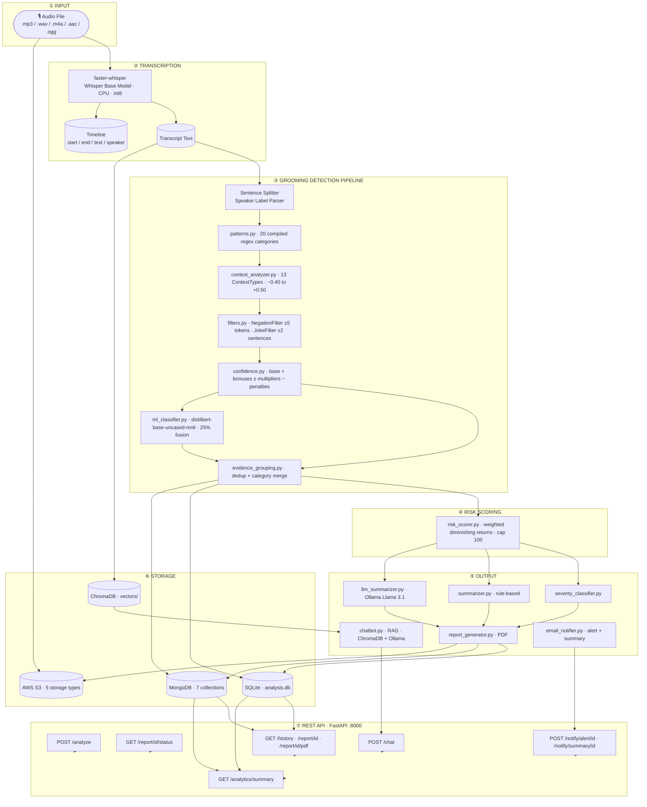

# AuraSafety — Backend

Production-grade FastAPI backend for detecting grooming behaviour, explicit content, and harmful language in audio conversations. Supports Discord voice chats, WhatsApp calls, Zoom meetings, gaming voice chats, and any general audio source.

---

## Architecture



---

## Table of Contents

- [Tech Stack](#tech-stack)
- [Project Structure](#project-structure)
- [Detection Categories](#detection-categories)
- [Context Classification](#context-classification)
- [Confidence Scoring](#confidence-scoring)
- [ML Classifier](#ml-classifier)
- [Risk Scoring](#risk-scoring)
- [Filters](#filters)
- [Evidence Grouping](#evidence-grouping)
- [Storage](#storage)
- [Email Notifications](#email-notifications)
- [Modules Reference](#modules-reference)
- [API Endpoints](#api-endpoints)
- [Configuration](#configuration)
- [Environment Variables](#environment-variables)
- [Running the Server](#running-the-server)
- [Test Scripts](#test-scripts)
- [Interactive Pipeline Tester](#interactive-pipeline-tester)
- [Design Principles](#design-principles)

---

## Tech Stack

| Layer | Technology |
|---|---|
| API Framework | FastAPI 0.136 + Uvicorn 0.47 |
| Audio Transcription | faster-whisper 1.2 (Whisper Base, CPU, int8) |
| Speaker Diarization | pyannote.audio 3.3 (optional — requires `HF_TOKEN`) |
| Pattern Detection | Python `re` — 20 compiled regex categories |
| ML Classifier | `typeform/distilbert-base-uncased-mnli` — Zero-Shot NLI |
| LLM Summary | Ollama — Llama 3.1 (optional, graceful fallback) |
| Vector Store | ChromaDB (persistent) |
| Embeddings | SentenceTransformers `all-MiniLM-L6-v2` |
| Primary Database | SQLite via SQLAlchemy ORM |
| Analytics Database | MongoDB Atlas — 7 collections |
| File Storage | AWS S3 — 5 storage types, AES-256 encrypted |
| Email | SMTP (Gmail / any provider) — HTML alert + summary templates |
| PDF Generation | ReportLab |
| Runtime | Python 3.10+ |

---

## Project Structure

```
backend/
│
├── app.py                          # FastAPI application — all routes + background tasks
├── config.py                       # Paths, DB URL, SMTP, S3, MongoDB config
├── auth.py                         # API key authentication helpers
├── requirements.txt                # Python dependencies
├── test_pipeline.py                # Interactive CLI pipeline tester
├── test_email.py                   # 4-step SMTP integration test
├── debug_env.py                    # Low-level SMTP credential debugger
├── .env.example                    # Environment variable template
│
├── api/
│   └── audio_analysis_routes.py   # Versioned router /api/v1/* (Pydantic, pagination)
│
├── services/
│   └── audio_safety_service.py    # Async pipeline orchestration service
│
├── schemas/
│   └── audio_analysis_schemas.py  # Pydantic request/response models
│
├── modules/
│   ├── patterns.py                # 20-category compiled regex library
│   ├── context_analyzer.py        # ContextType enum + multipliers
│   ├── confidence.py              # Confidence scoring engine
│   ├── filters.py                 # NegationFilter + JokeFilter
│   ├── ml_classifier.py           # Zero-shot NLI (distilbert-mnli), LRU cache
│   ├── grooming_detector.py       # Main pipeline orchestrator
│   ├── evidence_grouping.py       # Deduplication + category merging
│   ├── risk_scorer.py             # Weighted risk scoring (0–100) + diminishing returns
│   ├── severity_classifier.py     # Score → Safe / Low / Moderate / High / Critical
│   ├── summarizer.py              # Rule-based summary generator
│   ├── llm_summarizer.py          # Ollama Llama 3.1 summary
│   ├── report_generator.py        # PDF report generation
│   ├── transcriber.py             # faster-whisper transcription → (transcript, timeline)
│   ├── evidence_extractor.py      # Evidence list extraction from grouped findings
│   ├── stats.py                   # Statistics + timeline + ML agreement
│   ├── chatbot.py                 # RAG chatbot (ChromaDB + Ollama)
│   ├── email_notifier.py          # SMTP alert + summary HTML emails
│   ├── s3_storage.py              # AWS S3 upload / presign / delete
│   ├── cache.py                   # TTL in-memory cache helpers
│   └── file_cleanup.py            # Upload file cleanup daemon
│
├── database/
│   ├── db.py                      # SQLAlchemy engine + session factory
│   ├── models.py                  # AudioAnalysis ORM model
│   └── mongo.py                   # MongoDB client — 7-collection schema
│
├── examples/
│   ├── test_script_bad.txt        # CRITICAL — all categories triggered
│   ├── test_script_medium.txt     # MODERATE — ambiguous online gaming chat
│   ├── test_script_good.txt       # LOW — safe classroom exchange
│   └── run_test_scripts.py        # Pipeline test runner
│
└── (auto-created on first run, git-ignored)
    ├── uploads/                   # Uploaded audio files
    ├── reports/                   # Generated PDF reports
    ├── vectors/                   # ChromaDB persistent vector store
    ├── analysis.db                # SQLite database
    └── logs/app.log               # Application log (UTF-8, stdout + file)
```

---

## Detection Categories

The pipeline detects **20 categories** across the full grooming lifecycle.

### Critical Severity

| Category | Weight | Description |
|---|---|---|
| `explicit_content` | 25 | Sexual solicitation, nude requests, sexting, CSAM references |
| `threats_coercion` | 22 | Blackmail, photo threats, reputation threats, "do it or else" |
| `emotional_exploitation` | 18 | Guilt-tripping, "you're all I have", self-harm threats as control |
| `isolation` | 16 | Discrediting friends/family, "you only need me", encouraging withdrawal |
| `secrecy` | 15 | "Don't tell anyone", "delete these messages", "our secret" |
| `meeting` | 20 | Arranging in-person contact, "sneak out", "come to my place" |
| `address` | 20 | Requesting physical location, home address, zip code |
| `manipulation` | 10 | Coercion, conditional threats, peer pressure, proof demands |

### High Severity

| Category | Weight | Description |
|---|---|---|
| `personal_information` | 18 | Phone numbers, email, social handles, real name, age, passwords |
| `parent_monitoring` | 15 | Questions about parental supervision of messages/phone |
| `age_deception` | 14 | "I'm the same age", "age is just a number", "you're mature for your age" |
| `desensitization` | 14 | "It's normal", "everyone does it", minimising inappropriate behaviour |
| `gift_bribery` | 12 | Gift offers, money, gaming currency, "I'll buy you anything" |
| `video_call` | 10 | Video call requests, camera requests, selfie demands |
| `school` | 10 | School name, grade, dismissal time, teacher names |
| `routine` | 10 | Daily schedule, walk-home route, when alone at home |
| `relationship_building` | 5 | Building personal dependency, "you're special to me" |

### Medium Severity

| Category | Weight | Description |
|---|---|---|
| `gaming_luring` | 10 | Roblox/Fortnite contact, "join my private server", moving to DMs |
| `bad_language` | 8 | Profanity, slurs, hate speech, aggressive/threatening language |
| `trust_building` | 5 | "Trust me", "I'm here for you", "you can tell me anything" |

---

## Context Classification

Every sentence is classified into one or more `ContextType` values before confidence scoring. The type drives a multiplier — no speaker identity is ever consulted.

| ContextType | Multiplier | Meaning |
|---|---|---|
| `ADMINISTRATIVE` | −0.40 | Event logistics, forms, schedules — suppresses false positives |
| `INFORMATION_GATHERING` | +0.15 | Collecting personal details |
| `TRUST_BUILDING` | +0.20 | "I care about you", "trust me" |
| `RELATIONSHIP_BUILDING` | +0.15 | "special connection", "best friends" |
| `MANIPULATION` | +0.30 | "they won't understand", coercion |
| `SECRECY` | +0.40 | "don't tell anyone", "our secret" |
| `ESCALATION` | +0.35 | Private call, move to another platform |
| `MEETING` | +0.35 | Meet up, in person, hang out |
| `PERSONAL_INFORMATION` | +0.30 | Address, phone, email, route |
| `VIDEO_CALL` | +0.25 | Video chat, FaceTime, camera requests |
| `EXPLICIT_CONTENT` | +0.50 | Sexual language — highest multiplier |
| `BAD_LANGUAGE` | +0.20 | Profanity, slurs, threats |
| `NEUTRAL` | 0.00 | No strong signal |

---

## Confidence Scoring

```
score = pattern_strength
      + exact_phrase_bonus      (+0.15 if matched text is a known exact phrase)
      + keyword_bonus           (+0.10 if ≥2 supporting keywords present)
      + context_multiplier      (from ContextType above, −0.40 to +0.50)
      − negation_penalty        (up to −0.40, token-scoped within ±5 tokens)
      − joke_penalty            (up to −0.50, ±2 sentence window)

regex_confidence = clamp(score, 0.0, 1.0)

# ML fusion (25% weight, when enabled)
fused_confidence = 0.75 × regex_confidence + 0.25 × ml_category_score
```

---

## ML Classifier

- Model: `typeform/distilbert-base-uncased-mnli` (Zero-Shot NLI via HuggingFace)
- 13 labels mapped to detection categories
- Temperature calibration T=1.3 for better-calibrated probabilities
- Multi-label detection threshold: ≥0.15
- Agreement/disagreement signal surfaced in each finding under `finding["ml"]`
- LRU cache: 512 entries — repeated sentences are free after first inference
- Fused at 25% weight into the final confidence score
- **Disabled by default** (`ENABLE_ML_CLASSIFIER=false`) — enable once model is cached (~400 MB download on first run)

---

## Risk Scoring

```
effective_score = weight × confidence          (1st occurrence)
effective_score = weight × confidence × DR     (repeated occurrences)
total_score     = Σ effective_scores, capped at 100
```

Diminishing returns — repeated occurrences of the same category are progressively down-weighted (100% → 50% → 25% → 12.5% → …) so a single repeated phrase cannot dominate the score.

| Risk Level | Score Range | Meaning |
|---|---|---|
| Safe | 0–20 | No significant indicators |
| Low | 21–40 | Minor concerns, may warrant monitoring |
| Moderate | 41–60 | Multiple indicators, increased monitoring recommended |
| High | 61–80 | Significant patterns, immediate review recommended |
| Critical | 81–100 | Severe behaviour, urgent intervention required |

---

## Filters

**NegationFilter** — token-scoped: negation only suppresses a finding if the negation word is within 5 tokens of the matched phrase. Secrecy phrases like "nobody needs to know" are exempt because the negation is part of the threat.

**JokeFilter** — ±2 sentence window. Joke indicators (`lol`, `jk`, `just kidding`, `😂`, etc.) in the current or neighbouring sentence apply up to −0.50 confidence penalty.

---

## Evidence Grouping

When a single sentence matches multiple categories, `EvidenceGroupingEngine` merges them into one grouped finding with aggregate confidence and severity — preventing the same quote from inflating the score across categories.

---

## Storage

### SQLite (`analysis.db`)

Primary operational store — every analysis result is written here. Created automatically on first run.

```
audio_analysis
├── id             INTEGER  PRIMARY KEY AUTOINCREMENT
├── filename       TEXT
├── transcript     TEXT
├── findings       TEXT     JSON array of grouped findings
├── evidence       TEXT     JSON array of evidence items
├── stats          TEXT     JSON stats object
├── summary        TEXT     Rule-based summary
├── llm_summary    TEXT     Ollama LLM summary (or rule summary if Ollama unavailable)
├── severity       TEXT     Safe / Low / Moderate / High / Critical
├── risk_score     REAL     0.0 – 100.0
├── pdf_path       TEXT     Local path to generated PDF
├── diarization    TEXT     JSON timeline array
├── status         TEXT     PENDING / PROCESSING / COMPLETED / FAILED
├── error_message  TEXT     Populated only on FAILED status
├── created_at     DATETIME
└── updated_at     DATETIME
```

### MongoDB (7 collections)

Analytics and audit store written on every completed analysis:

| Collection | Contents |
|---|---|
| `meeting_metadata` | Filename, date, duration, participants, S3 URL, status |
| `transcripts` | Full transcript, speaker segments, timestamps, word count |
| `analysis_results` | Risk score, severity, LLM summary, rule summary, stats |
| `safety_findings` | Per-finding category, evidence, confidence, context type, ML fields |
| `action_items` | High/critical findings requiring action, topics, keywords |
| `processing_status` | Pipeline stage, started_at, completed_at, errors |
| `audit_logs` | All events — uploads, completions, failures, emails sent |

### AWS S3 (5 storage types)

All files are AES-256 server-side encrypted:

| Type | S3 Prefix | Description |
|---|---|---|
| Audio recordings | `recordings/YYYY/MM/` | Original uploaded audio |
| Extracted audio | `recordings/YYYY/MM/` | Converted/extracted audio |
| PDF reports | `reports/YYYY/MM/` | Generated analysis PDFs |
| Exports | `exports/YYYY/MM/` | CSV / JSON / XLSX exports |
| Backups | `backups/YYYY/MM/` | Long-term archives |

Presigned URLs and deletion are also supported. S3 is non-blocking — a failure does not abort the analysis pipeline.

---

## Email Notifications

Two email types are supported, both rendered as dark-themed HTML with a risk score circle, severity badge, and findings summary.

**Automatic alert** — sent at the end of every analysis where severity meets or exceeds `ALERT_SEVERITY` (default: `High`). Includes top 5 findings and a PDF attachment.

**On-demand summary** — triggered via `POST /notify/summary/{id}`. Includes LLM summary, rule-based summary, and category breakdown table.

**Manual re-send** — `POST /notify/alert/{id}` re-sends the alert email for any report regardless of severity. Accepts an optional `recipients` override.

Both endpoints log to MongoDB `audit_logs` and return `{"success": bool, "message": str, "recipients": [...]}`.

---

## Modules Reference

| Module | Purpose |
|---|---|
| `patterns.py` | 20-category compiled regex library, `CATEGORY_METADATA`, `match_patterns()` |
| `context_analyzer.py` | `ContextType` enum, `CONTEXT_MULTIPLIERS`, `ContextAnalyzer.classify()` |
| `confidence.py` | `ConfidenceCalculator` — full scoring breakdown per finding |
| `filters.py` | `NegationFilter`, `JokeFilter`, `CombinedFilter` |
| `ml_classifier.py` | Zero-shot NLI, 13 labels, temperature calibration, LRU cache, `fuse_with_regex()` |
| `evidence_grouping.py` | `EvidenceGroupingEngine` — dedup + category merge + aggregate confidence |
| `grooming_detector.py` | `GroomingDetector` — main pipeline orchestrator |
| `risk_scorer.py` | `WeightedRiskScorer` — weighted scoring with diminishing returns |
| `severity_classifier.py` | Score → Safe / Low / Moderate / High / Critical |
| `summarizer.py` | Rule-based summary from findings + risk score |
| `llm_summarizer.py` | Ollama Llama 3.1 executive summary — fails gracefully |
| `report_generator.py` | PDF report with findings, score, severity, LLM summary |
| `transcriber.py` | faster-whisper — returns `(transcript, timeline)` |
| `evidence_extractor.py` | Clean evidence list from grouped findings |
| `stats.py` | Statistics dict — categories, confidence histogram, ML stats, context distribution |
| `chatbot.py` | RAG chatbot — ChromaDB + SentenceTransformers + Ollama |
| `email_notifier.py` | SMTP alert + summary emails, `should_auto_alert()`, `send_alert_email()`, `send_summary_email()` |
| `s3_storage.py` | `upload_audio()`, `upload_pdf_report()`, `get_presigned_url()`, `delete_file()`, `ping()` |
| `cache.py` | TTL in-memory cache helpers |
| `file_cleanup.py` | Upload file cleanup daemon |

---

## API Endpoints

### Core

| Method | Path | Description |
|---|---|---|
| `GET` | `/` | Service name + version |
| `GET` | `/health` | S3 + MongoDB + ML classifier health |
| `POST` | `/analyze` | Upload audio — returns immediately, runs pipeline in background |
| `GET` | `/report/{id}/status` | Poll status: `PROCESSING` / `COMPLETED` / `FAILED` |
| `GET` | `/history` | Paginated history — `id`, `filename`, `severity`, `risk_score`, `status`, `created_at` |
| `GET` | `/report/{id}` | Full report — transcript, findings, evidence, stats, summaries, timeline |
| `GET` | `/report/{id}/evidence` | Evidence list with `severity`, `risk_score`, `context_type`, `speaker` |
| `GET` | `/report/{id}/stats` | Full stats object |
| `GET` | `/report/{id}/pdf` | Download PDF report |
| `DELETE` | `/report/{id}` | Delete report record and associated PDF file |
| `POST` | `/chat` | RAG chatbot — returns `{answer, sources, confidence}` |

### Notifications

| Method | Path | Description |
|---|---|---|
| `POST` | `/notify/alert/{id}` | Send (or re-send) a red-alert email |
| `POST` | `/notify/summary/{id}` | Send a full analysis summary email |

Both accept `{"recipients": ["email@example.com"]}` to override `ALERT_RECIPIENTS`.

### Analytics

| Method | Path | Description |
|---|---|---|
| `GET` | `/analytics/summary` | Cross-report aggregation — severity distribution, risk histogram, top categories, ML agreement, confidence histogram, status distribution |

### Versioned Router (`/api/v1/`)

Mirrors the core endpoints with Pydantic response models and pagination. Used by the React frontend.

### Examples

```bash
# Upload and analyze
curl -X POST http://localhost:8000/analyze -F "file=@conversation.mp3"
# → {"id": 12, "status": "PROCESSING", "message": "Analysis started in background"}

# Poll until complete
curl http://localhost:8000/report/12/status
# → {"id": 12, "status": "COMPLETED", "error_message": null}

# Get full report
curl http://localhost:8000/report/12

# Ask the chatbot
curl -X POST http://localhost:8000/chat \
  -H "Content-Type: application/json" \
  -d '{"report_id": 12, "question": "What secrecy phrases were used?"}'

# Send alert email
curl -X POST http://localhost:8000/notify/alert/12 \
  -H "Content-Type: application/json" \
  -d '{"recipients": ["analyst@example.com"]}'

# Delete a report
curl -X DELETE http://localhost:8000/report/12

# Cross-report analytics
curl http://localhost:8000/analytics/summary
```

---

## Configuration

Key runtime parameters you can tune without touching the pipeline code:

```python
# grooming_detector.py — constructor defaults
GroomingDetector(
    min_confidence_threshold = 0.15,   # drop findings below this (API default: 0.30)
    enable_context_analysis  = True,   # apply ContextType multipliers
    enable_filters           = True,   # apply negation + joke penalties
    enable_grouping          = True,   # deduplicate via EvidenceGroupingEngine
    enable_ml_classifier     = False,  # set True once model is cached (~400 MB)
)

# risk_scorer.py — weight overrides
WeightedRiskScorer(
    custom_weights = {"explicit_content": 30, "threats_coercion": 25},
    enable_diminishing_returns = True,
)

# audio_safety_service.py — service-level flags
AudioSafetyService(
    min_confidence_threshold = 0.30,
    enable_llm_summary       = True,   # set False to skip Ollama entirely
    enable_vector_storage    = True,   # set False to skip ChromaDB indexing
)
```

---

## Environment Variables

Copy `.env.example` to `.env` and fill in your values. All three integrations (MongoDB, S3, SMTP) are optional — the core analysis pipeline runs without them.

```env
# ── SMTP ──────────────────────────────────────────────────────────────────────
SMTP_HOST=smtp.gmail.com
SMTP_PORT=587
SMTP_USER=your-email@gmail.com
SMTP_PASSWORD=your-16-char-app-password   # Gmail: use an App Password, not your account password
SMTP_FROM_NAME=AuraSafety
ALERT_RECIPIENTS=analyst@yourorg.com,supervisor@yourorg.com
ALERT_SEVERITY=High          # High or Critical — threshold for auto-alerts
APP_URL=http://localhost:5173 # used in "View Report" email links

# ── MongoDB ───────────────────────────────────────────────────────────────────
MONGO_URI=mongodb+srv://<user>:<password>@<cluster>.mongodb.net/<dbname>?retryWrites=true&w=majority
MONGO_DB_NAME=audio_safety_db

# ── AWS S3 ────────────────────────────────────────────────────────────────────
AWS_ACCESS_KEY_ID=your-access-key-id
AWS_SECRET_ACCESS_KEY=your-secret-access-key
AWS_REGION=us-east-1
S3_BUCKET_NAME=your-bucket-name

# ── Speaker Diarization ───────────────────────────────────────────────────────
HF_TOKEN=your-huggingface-token   # required for pyannote.audio
ENABLE_DIARIZATION=false          # adds ~90s per 3-min file on CPU

# ── Feature Flags ─────────────────────────────────────────────────────────────
ENABLE_ML_CLASSIFIER=false        # set true after ~400 MB model is cached
MAX_UPLOAD_MB=200
ALLOWED_ORIGINS=http://localhost:5173,http://127.0.0.1:5173
API_KEY=                          # leave blank to disable auth in dev
UPLOAD_TTL_HOURS=24               # 0 = disable upload cleanup
```

> **Gmail tip:** Generate a 16-character App Password at https://myaccount.google.com/apppasswords — 2FA must be enabled first.

---

## Running the Server

### Prerequisites

```bash
pip install -r requirements.txt

# Ollama (optional — for LLM summaries and chatbot)
# Install from https://ollama.com then:
ollama pull llama3.1
```

### Start

```bash
uvicorn app:app --host 0.0.0.0 --port 8000 --reload
```

- Swagger UI: http://localhost:8000/docs
- ReDoc: http://localhost:8000/redoc

### Supported audio formats

`.mp3` `.wav` `.m4a` `.aac` `.ogg`

---

## Test Scripts

```bash
python examples/run_test_scripts.py
```

| Script | Expected Score | Severity | Description |
|---|---|---|---|
| `test_script_bad.txt` | 100 | CRITICAL | All 20 categories triggered |
| `test_script_medium.txt` | ~53 | MODERATE | Trust-building, routine probing, video call |
| `test_script_good.txt` | 0 | LOW | Safe classroom exchange — zero findings |

Set `ENABLE_ML = True` in `run_test_scripts.py` to include the ML classifier layer (~400 MB model download on first run).

---

## Interactive Pipeline Tester

```bash
python test_pipeline.py
```

Runs any sentence or multi-line transcript through the full detection pipeline interactively. Each input prints:

1. **Context classification** — matched ContextType(s) and multiplier
2. **Filter results** — negation score, joke score, combined penalty
3. **Per-category findings** — category, confidence, matched text, severity
4. **Risk breakdown** — weighted score per category, total risk score, risk level

```
pipeline> keep this between us, nobody needs to know
pipeline> age is just a number
pipeline> I'll buy you whatever you want
pipeline> clear          ← clears the screen
```

Uses a lower confidence threshold (0.15) than the API default (0.30) to surface borderline matches during development.

---

## Utility Scripts

### `test_email.py` — Email Integration Test

Verifies the full SMTP setup in 4 steps without needing a real audio file:

```bash
python test_email.py
```

1. Config check — validates `SMTP_USER`, `SMTP_PASSWORD`, `ALERT_RECIPIENTS` are set
2. SMTP connection — connects to the server, runs STARTTLS, authenticates
3. Alert email — sends a real red-alert email with mock Critical findings
4. Summary email — sends a real summary email with mock data

### `debug_env.py` — SMTP Credential Debugger

Low-level SMTP auth debugger for diagnosing Gmail App Password issues:

```bash
python debug_env.py
```

Prints raw credential values (length, leading/trailing chars, presence of spaces or quotes) and attempts a direct `smtplib` login.

---

## Design Principles

**No role-based assumptions** — speaker labels are stored for audit only. The same sentence scores identically regardless of who said it.

**Token-scoped negation** — "I did not ask for your address" is negated. "I never lie but I want your address" is not — the negation word is too far from the matched phrase.

**Diminishing returns** — the first occurrence of any category gets full weight. Repeated occurrences are progressively down-weighted (50%, 25%, 12.5%, …) so a single repeated phrase cannot dominate the score.

**Administrative suppression** — sentences classified as `ADMINISTRATIVE` receive a −0.40 confidence multiplier, suppressing false positives from legitimate institutional language.

**Graceful degradation** — MongoDB, S3, SMTP, and Ollama are all optional. A failure in any of them is logged as a warning and the pipeline continues. The core analysis always runs.

**Background processing** — `/analyze` returns immediately with a record ID. The client polls `/report/{id}/status` until `COMPLETED`.
